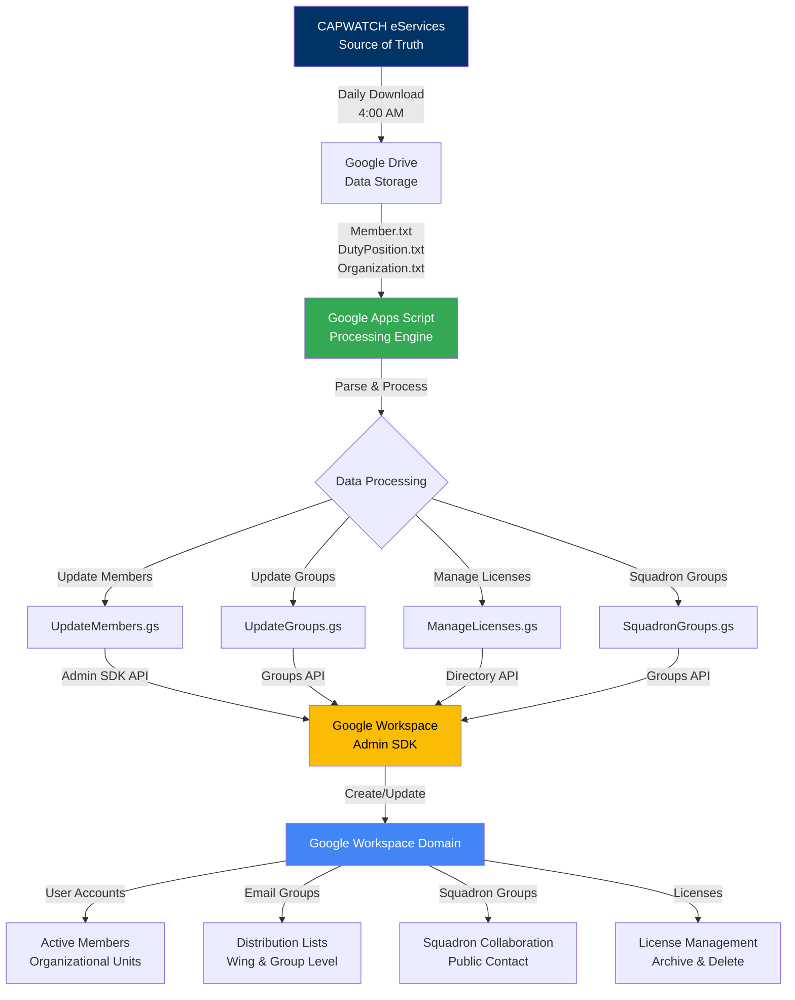
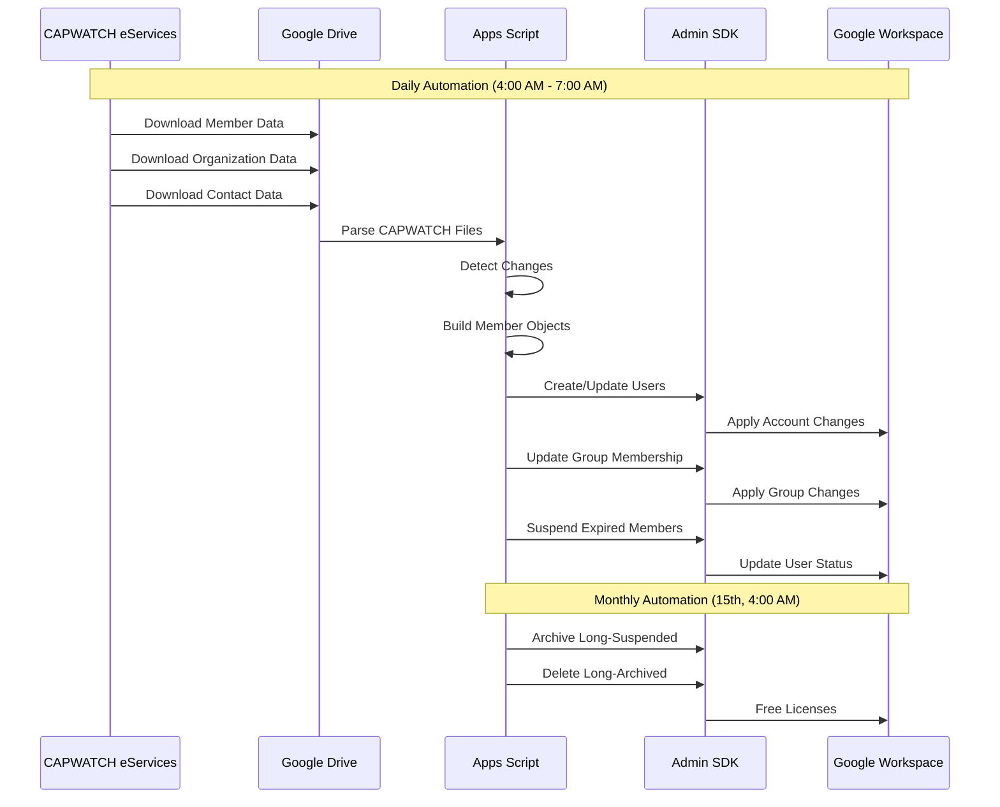
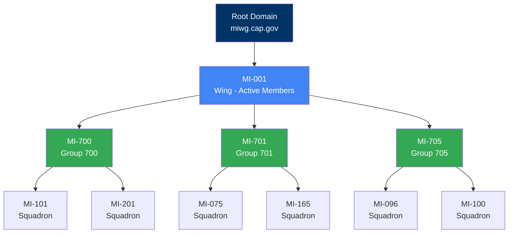

# CAPWATCH Google Workspace Automation

> **Automated management of Google Workspace accounts and groups based on CAPWATCH data for Civil Air Patrol wings**

[](https://opensource.org/licenses/MIT)
[](https://www.google.com/script/start/)
[](https://github.com)

## Overview

This project provides a complete automation solution for Civil Air Patrol (CAP) wings to synchronize their Google Workspace environment with CAPWATCH membership data. It eliminates manual account management, ensures data accuracy, and optimizes license utilization.

### What It Does

- **Automated Account Management**: Creates, updates, and suspends Google Workspace accounts based on member status
- **Email Group Synchronization**: Maintains email distribution groups based on member attributes (rank, duty positions, achievements, etc.)
- **Squadron-Level Groups**: Creates and manages squadron-specific groups for unit collaboration
- **License Optimization**: Automatically archives inactive accounts and manages license allocation
- **Data Integration**: Daily downloads and processing of CAPWATCH data files
- **Error Tracking**: Comprehensive logging and error reporting for troubleshooting

### Key Benefits

- **Zero Manual Updates**: Member changes automatically sync from CAPWATCH
- **Cost Savings**: Automated license management reduces wasted licenses
- **Data Accuracy**: Single source of truth (CAPWATCH) prevents sync issues
- **Scalable**: Handles wings of any size with automated batch processing
- **Auditable**: Detailed logging tracks all changes for compliance
- **No Infrastructure Required**: Runs entirely within Google Apps Script and Drive

## Table of Contents

- [Features](#features)
- [System Architecture](#system-architecture)
- [Prerequisites](#prerequisites)
- [Installation](#installation)
- [Configuration](#configuration)
- [Usage](#usage)
- [Module Documentation](#module-documentation)
- [Troubleshooting](#troubleshooting)
- [Contributing](#contributing)
- [License](#license)
- [Support](#support)

## Features

### Account & Email Group Management
- Automatic user account creation and updates
  - Username: Member's CAPID (e.g., 123456@miwg.cap.gov)
  - Email alias: firstname.lastname@miwg.cap.gov
- Email alias management with automatic conflict resolution
- Wing-level and group-level distribution lists
- Squadron-level collaborative groups
- Manual member additions via spreadsheet

### License Lifecycle Management
- Auto-suspend expired members after grace period
- Archive long-suspended users (1+ year)
- Delete long-archived users (5+ years)
- Reactivate renewed members automatically
- Detailed lifecycle reporting

### Data Synchronization
- Daily CAPWATCH data downloads
- Incremental updates (only changed records)
- Change detection and delta processing
- Comprehensive error tracking
- Automated retry logic for API failures

### Monitoring & Reporting
- Structured JSON logging
- Email reports for license management
- Error tracking spreadsheet
- Progress indicators for long operations

## System Architecture



### Data Flow Overview



## Prerequisites

### Required

- **Google Workspace Account**: Domain administrator access
- **CAP eServices Access**: CAPWATCH API credentials for your wing
  - Note: CAPWATCH access requires a security assessment and commander approval
- **Google Apps Script**: Projects enabled in your workspace

### Recommended Skills

- Basic JavaScript/Google Apps Script knowledge
- Familiarity with Google Workspace Admin Console
- Understanding of CAP organizational structure
- Experience with Google Sheets

## Installation

### Step 1: Create Google Apps Script Project

1. Go to [Google Apps Script](https://script.google.com/)
2. Create a new project
3. Copy all `.gs` files from this repository into your project:
   - `config.gs` (configure first)
   - `utils.gs`
   - `GetCapwatch.gs`
   - `src/accounts-and-groups/UpdateMembers.gs`
   - `src/accounts-and-groups/UpdateGroups.gs`
   - `src/accounts-and-groups/ManageLicenses.gs`
   - `src/squadron-groups/SquadronGroups.gs`

**Note**: When you first run any function, Google Apps Script will automatically prompt you to authorize the required permissions.

### Step 2: Create Required Google Drive Structure

1. Create a **top-level "Automation" folder** in Google Drive
   - This will contain your Apps Script project and configuration spreadsheet
   - Note the folder ID from the URL

2. Create a **"CAPWATCH Data" subfolder** inside the Automation folder
   - This will store downloaded CAPWATCH files
   - Note the folder ID from the URL

3. In the Automation folder, create the **automation spreadsheet**: "CAPWATCH Automation Config"
   - Add these sheets: `Groups`, `User Additions`, `Error Emails` (header row only)
   - Note spreadsheet ID from URL

4. In the CAPWATCH Data folder, create the following files:
   - `CurrentMembers.txt` (empty JSON file: `{}`)
   - `EmailGroups.txt` (empty JSON file: `{}`)
   - `OrgPaths.txt` (CSV file - see example in `/examples` directory)

**OrgPaths.txt Format**:
```csv
ORGID,OrgUnitPath
223,/MI-001
1984,/MI-001/MI-700
2774,/MI-001/MI-705/MI-100
```
- ORGID: From CAPWATCH Organization.txt file
- OrgUnitPath: Organizational Unit path from Google Admin Console
  - Wing level: `/MI-001`
  - Group level: `/MI-001/MI-705`
  - Squadron level: `/MI-001/MI-705/MI-100`

### Step 3: Configure Your Wing

1. Open `config.gs`
2. Update the following constants:
   ```javascript
   CAPWATCH_ORGID: '223',  // Your wing ORGID
   WING: "MI",              // Your wing abbreviation
   EMAIL_DOMAIN: "@miwg.cap.gov",  // Your email domain
   DOMAIN: "miwg.cap.gov",  // Your Google Workspace domain
   CAPWATCH_DATA_FOLDER_ID: '<your-folder-id>',
   AUTOMATION_FOLDER_ID: '<your-folder-id>',
   AUTOMATION_SPREADSHEET_ID: '<your-spreadsheet-id>'
   ```

3. Update notification emails:
   ```javascript
   RETENTION_EMAIL: '<your-retention-email>',  // Or comment out if not using retention workflows
   DIRECTOR_RECRUITING_EMAIL: '<director-email>',
   AUTOMATION_SENDER_EMAIL: '<sender-email>',  // Create service account in Admin Console
   ITSUPPORT_EMAIL: '<it-email>'
   ```
   **Note**: If not setting up retention workflows, you can comment out all emails except `ITSUPPORT_EMAIL`.

### Step 4: Set Up CAPWATCH Credentials

1. In your Google Apps Script project, open `GetCapwatch.gs`
2. Find the `setAuthorization()` function
3. **Temporarily** add your eServices username and password in the function
4. Run `setAuthorization()` once
5. **Important**: Immediately clear the username and password from the code after running

### Step 5: Create Organizational Units

Set up your OU structure in Google Workspace Admin Console following the Wing → Group → Squadron hierarchy:



**Note**: Groups are geographic/organizational entities between Wing and Squadron level. This structure allows for group-level email distribution lists.

### Step 6: Set Up Automation Triggers

Create time-driven triggers for the following functions. **Important**: Due to CAPWATCH blackout overnight, timing is critical:

| Function | Frequency | Time Window | Purpose |
|----------|-----------|-------------|---------|
| `getCapwatch()` | Daily | 4:00-5:00 AM | Download CAPWATCH data (after blackout) |
| `updateAllMembers()` | Daily | 5:00-6:00 AM | Sync member accounts |
| `suspendExpiredMembers()` | Daily | 5:00-6:00 AM | Suspend expired members (7-day grace) |
| `updateEmailGroups()` | Daily | 5:00-6:00 AM | Update group memberships |
| `updateAdditionalGroupMembers()` | Daily | 6:00-7:00 AM | Add manual members from spreadsheet |
| `updateMissingAliases()` | Daily | 6:00-7:00 AM | Fix missing email aliases |
| `updateAllSquadronGroups()` | Daily | 6:00-7:00 AM | Update squadron group membership |
| `manageLicenseLifecycle()` | Monthly | 15th, 4:00 AM | Archive/delete old accounts |

**Note**: Google Apps Script allows 1-hour scheduling blocks. The script will run sometime within the specified hour.

## Configuration

### Group Configuration Spreadsheet

The **Groups** sheet defines which email groups to create and maintain:

| Column | Description | Example |
|--------|-------------|---------|
| Category | Group category for organization | `member-type` |
| Group Name | Base group name (without domain) | `cadets` |
| Attribute | Member attribute to filter on | `type` |
| Values | Comma-separated values to match | `CADET` |

**Supported Attributes:**
- `type`: Member type (CADET, SENIOR, AEM, etc.)
- `rank`: Member rank
- `dutyPositionIds`: Duty position codes
- `dutyPositionIdsAndLevel`: Position + level combination
- `dutyPositionLevel`: Position level only
- `achievements`: Member achievements
- `contact`: Contact types (for parent/guardian emails)

### License Configuration

Adjust lifecycle settings in `config.gs`:

```javascript
const LICENSE_CONFIG = {
  DAYS_BEFORE_ARCHIVE: 365,  // Suspend → Archive
  DAYS_BEFORE_DELETE: 1825,   // Archive → Delete (5 years)
  MAX_BATCH_SIZE: 500,
  NOTIFICATION_EMAILS: [...]
};
```

### Organizational Paths

The `OrgPaths.txt` file maps CAPWATCH org IDs to Google Workspace OUs:

```csv
orgid,orgPath
223,/MI-001
1984,/MI-001/MI-700
1308,/MI-001/MI-700/MI-096
```

## Usage

### Running Manual Updates

You can run functions manually from the Apps Script editor:

```javascript
// Download latest CAPWATCH data
getCapwatch();

// Update all member accounts
updateAllMembers();

// Update email groups
updateEmailGroups();

// Update squadron groups
updateAllSquadronGroups();

// Suspend expired members
suspendExpiredMembers();

// Run license lifecycle management
manageLicenseLifecycle();
```

### Testing Functions

Use the provided test functions to verify configuration:

```javascript
// Test member retrieval
testGetMember();

// Test squadron data
testGetSquadrons();

// Preview license lifecycle changes (no modifications)
previewLicenseLifecycle();
```

### Monitoring

1. **Execution Logs**: View in Apps Script editor under "Executions"
2. **Email Reports**: Receive monthly license management summaries
3. **Error Tracking**: Check "Error Emails" sheet in automation spreadsheet
4. **Drive Files**: Review `EmailGroups.txt` and `CurrentMembers.txt` for state

## Module Documentation

### Core Modules

- **[Accounts & Groups](src/accounts-and-groups/README.md)** - Member and group management
  - Member synchronization
  - Email group automation
  - License lifecycle management

- **[Squadron Groups](src/squadron-groups/README.md)** - Squadron-level group management
  - Access groups for shared resources
  - Public contact emails
  - Unit distribution lists

- **[Recruiting & Retention](src/recruiting-and-retention/README.md)** - R&R workflows
  - Automated retention emails
  - Lifecycle notifications
  - Member engagement tracking

### Additional Documentation

- **[API Reference](docs/API_REFERENCE.md)** - Function documentation
- **[Troubleshooting Guide](docs/TROUBLESHOOTING.md)** - Common issues and solutions
- **[Development Guide](docs/DEVELOPMENT.md)** - Contributing and development setup
- **[Changelog](CHANGELOG.md)** - Version history and updates

## Troubleshooting

### Common Issues

**Problem**: Functions timing out
- **Solution**: Reduce `BATCH_SIZE` in `config.gs` or enable batch processing

**Problem**: Users not being created
- **Solution**: Check OrgPaths.txt has correct organizational unit mappings

**Problem**: Groups not updating correctly
- **Solution**: Verify group configuration in automation spreadsheet

**Problem**: Authorization errors
- **Solution**: Re-run `setAuthorization()` with valid credentials

See the [full troubleshooting guide](docs/TROUBLESHOOTING.md) for more solutions.

## Contributing

We welcome contributions from other CAP wings! Here's how to help:

1. **Fork** the repository
2. **Create** a feature branch (`git checkout -b feature/AmazingFeature`)
3. **Commit** your changes (`git commit -m 'Add some AmazingFeature'`)
4. **Push** to the branch (`git push origin feature/AmazingFeature`)
5. **Open** a Pull Request

### Development Guidelines

- Follow existing code style and structure
- Add JSDoc comments for all functions
- Include test functions for new features
- Update documentation for any changes
- Test thoroughly before submitting

See [DEVELOPMENT.md](docs/DEVELOPMENT.md) for detailed guidelines.

## Versioning

We use [Semantic Versioning](http://semver.org/) for releases. For available versions, see the [tags on this repository](https://github.com/cap-miwg/gsuite-automation/tags).

**Current Version**: 2.0.0 (December 2024)

## License

This project is licensed under the MIT License - see the [LICENSE](LICENSE) file for details.

## Acknowledgments

### Development Team

- **Luke Bunge** (lbunge) - Lead Developer (v1.0 → v2.0)
- **Jeremy Ginnard** (jginnard) - Original Developer (v1.0)

### Credits

- Michigan Wing IT Team - Testing and feedback
- CAP National IT - CAPWATCH API access

## Support

### Getting Help

- **Documentation**: Start with this README and linked guides
- **Issues**: [Submit an issue](https://github.com/cap-miwg/gsuite-automation/issues) on GitHub
- **Questions**: Open a discussion in the repository
- **Email**: Contact your wing IT team

### Related Resources

- [CAP eServices](https://www.capnhq.gov/CAP.eServices.Web/Default.aspx)
- [Google Workspace Admin Help](https://support.google.com/a)
- [Google Apps Script Documentation](https://developers.google.com/apps-script)
- [Admin SDK Directory API](https://developers.google.com/admin-sdk/directory)

---

**Made with ❤️ by Michigan Wing IT for the Civil Air Patrol community**

*This is an unofficial project and is not endorsed by CAP National*
