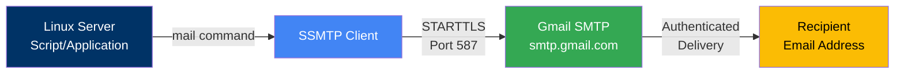
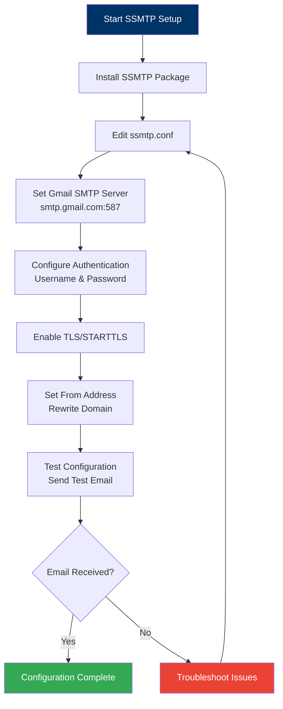

# SSMTP Email Configuration

> **Configure SSMTP for sending emails from Linux servers**

This utility allows Linux servers to send email notifications using Gmail SMTP. Useful for automated reports, monitoring alerts, and system notifications from your CAP infrastructure.

## Table of Contents

- [Overview](#overview)
- [Architecture](#architecture)
- [Prerequisites](#prerequisites)
- [Installation](#installation)
- [Configuration](#configuration)
- [Testing](#testing)
- [Usage Examples](#usage-examples)
- [Troubleshooting](#troubleshooting)

## Overview

SSMTP is a simple, lightweight SMTP client that allows command-line email sending from Linux systems. This is particularly useful for:
- Sending automated reports from scripts
- System monitoring alerts
- Backup completion notifications
- Cron job output emails

### What This Does

- Configures SSMTP to use Gmail SMTP relay
- Enables TLS/STARTTLS encryption
- Authenticates with Gmail credentials
- Allows standard `mail` command usage

## Architecture

### Email Flow



### Configuration Process



## Prerequisites

### Required

- **Linux Server**: Ubuntu, Debian, or similar distribution
- **Gmail Account**: For SMTP authentication
  - Recommend creating a dedicated service account
  - Enable 2-factor authentication
  - Generate app-specific password

### Recommended

- Root or sudo access
- Basic Linux command-line knowledge
- Understanding of SMTP concepts

## Installation

### Step 1: Install SSMTP

```bash
sudo apt update
sudo apt install ssmtp
```

For other distributions:
```bash
# Red Hat/CentOS
sudo yum install ssmtp

# Arch Linux
sudo pacman -S ssmtp
```

### Step 2: Create App Password (Gmail)

**Important**: Use an app-specific password, not your regular Gmail password.

1. Go to [Google Account Settings](https://myaccount.google.com/)
2. Navigate to Security
3. Enable 2-Step Verification (if not already enabled)
4. Click "App passwords"
5. Select "Mail" and "Other (Custom name)"
6. Name it "SSMTP - [Server Name]"
7. Copy the generated 16-character password

## Configuration

### Step 1: Edit SSMTP Configuration

Open the configuration file:
```bash
sudo nano /etc/ssmtp/ssmtp.conf
```

### Step 2: Add Configuration

Replace the entire file with the following (or append if you want to keep defaults):

```ini
# Gmail SMTP Configuration
root=your.email@gmail.com
mailhub=smtp.gmail.com:587
AuthUser=your.email@gmail.com
AuthPass=your-app-specific-password
UseTLS=YES
UseSTARTTLS=YES
rewriteDomain=gmail.com
hostname=your.email@gmail.com
FromLineOverride=YES
```

**Configuration Parameters Explained**:

| Parameter | Description | Example |
|-----------|-------------|---------|
| `root` | Email address for root user mail | `automation@gmail.com` |
| `mailhub` | Gmail SMTP server and port | `smtp.gmail.com:587` |
| `AuthUser` | Gmail username (full email) | `automation@gmail.com` |
| `AuthPass` | App-specific password | `abcd efgh ijkl mnop` |
| `UseTLS` | Enable TLS encryption | `YES` |
| `UseSTARTTLS` | Enable STARTTLS | `YES` |
| `rewriteDomain` | Domain for From address | `gmail.com` |
| `hostname` | Hostname for HELO/EHLO | `automation@gmail.com` |
| `FromLineOverride` | Allow custom From header | `YES` |

### Step 3: Secure the Configuration File

The configuration file contains your password, so restrict access:

```bash
sudo chmod 640 /etc/ssmtp/ssmtp.conf
sudo chown root:mail /etc/ssmtp/ssmtp.conf
```

### Step 4: Configure Reverse Aliases (Optional)

Edit `/etc/ssmtp/revaliases` to map local users to email addresses:

```bash
sudo nano /etc/ssmtp/revaliases
```

Add mappings:
```
root:your.email@gmail.com:smtp.gmail.com:587
username:your.email@gmail.com:smtp.gmail.com:587
```

## Testing

### Test 1: Simple Email

Send a test email using the `mail` command:

```bash
echo "This is a test email from SSMTP" | mail -s "Test Email" recipient@example.com
```

### Test 2: Email with Body

```bash
mail -s "Test Subject" recipient@example.com <<EOF
This is the email body.
It can have multiple lines.

Best regards,
Automated System
EOF
```

### Test 3: Verbose Output

Test with verbose output to troubleshoot:

```bash
echo "Test" | ssmtp -v recipient@example.com
```

### Test 4: From Script

Create a test script:

```bash
#!/bin/bash
# test-email.sh

RECIPIENT="recipient@example.com"
SUBJECT="Automated Test Email"
BODY="This email was sent automatically from $(hostname) at $(date)"

echo "$BODY" | mail -s "$SUBJECT" "$RECIPIENT"
```

Run the script:
```bash
chmod +x test-email.sh
./test-email.sh
```

## Usage Examples

### Example 1: Backup Completion Notification

```bash
#!/bin/bash
# backup-notify.sh

BACKUP_DIR="/backup"
RECIPIENT="admin@example.com"

# Perform backup
tar -czf /backup/backup-$(date +%Y%m%d).tar.gz /data

# Send notification
mail -s "Backup Completed - $(hostname)" "$RECIPIENT" <<EOF
Backup completed successfully on $(hostname)
Date: $(date)
Location: $BACKUP_DIR
Size: $(du -sh $BACKUP_DIR | cut -f1)

Please verify the backup files.
EOF
```

### Example 2: Disk Space Alert

```bash
#!/bin/bash
# disk-space-alert.sh

THRESHOLD=80
RECIPIENT="admin@example.com"

# Check disk usage
USAGE=$(df -h / | awk 'NR==2 {print $5}' | sed 's/%//')

if [ $USAGE -gt $THRESHOLD ]; then
    mail -s "ALERT: Disk Space Low on $(hostname)" "$RECIPIENT" <<EOF
Warning: Disk space usage is at ${USAGE}%

Current disk usage:
$(df -h /)

Please free up space or expand the disk.
EOF
fi
```

### Example 3: Cron Job Output

Add to crontab to receive cron job output via email:

```bash
# Edit crontab
crontab -e

# Add email address at the top
MAILTO=admin@example.com

# Add your cron jobs - output will be emailed
0 2 * * * /path/to/backup-script.sh
```

### Example 4: Service Monitoring

```bash
#!/bin/bash
# check-service.sh

SERVICE="apache2"
RECIPIENT="admin@example.com"

if ! systemctl is-active --quiet $SERVICE; then
    mail -s "ALERT: $SERVICE is down on $(hostname)" "$RECIPIENT" <<EOF
Critical: The $SERVICE service is not running on $(hostname)

Service status:
$(systemctl status $SERVICE)

Please investigate immediately.
EOF
fi
```

## Troubleshooting

### Common Issues

#### Email Not Sending

**Symptom**: No error, but email never arrives

**Possible Causes**:
- Incorrect Gmail credentials
- 2FA not enabled / no app password
- Gmail blocking "less secure app"
- Firewall blocking port 587

**Solution**:
```bash
# Test with verbose output
echo "Test" | ssmtp -v recipient@example.com

# Check for errors in logs
sudo tail -f /var/log/mail.log

# Verify port 587 is accessible
telnet smtp.gmail.com 587
```

#### Authentication Failed

**Symptom**: "Authentication failed" error

**Possible Causes**:
- Using regular password instead of app password
- Incorrect username/password
- Account locked or disabled

**Solution**:
1. Generate new app-specific password in Gmail
2. Update `/etc/ssmtp/ssmtp.conf` with new password
3. Verify username is full email address

#### TLS/SSL Errors

**Symptom**: "TLS/SSL error" or "Certificate verification failed"

**Possible Causes**:
- Outdated CA certificates
- System time incorrect
- TLS version mismatch

**Solution**:
```bash
# Update CA certificates
sudo apt update
sudo apt install ca-certificates
sudo update-ca-certificates

# Check system time
date
timedatectl

# If time is wrong, sync it
sudo ntpdate pool.ntp.org
```

#### Permission Denied

**Symptom**: "Permission denied" when running mail command

**Possible Causes**:
- User not in mail group
- Incorrect file permissions

**Solution**:
```bash
# Add user to mail group
sudo usermod -a -G mail $USER

# Fix permissions
sudo chmod 640 /etc/ssmtp/ssmtp.conf
sudo chown root:mail /etc/ssmtp/ssmtp.conf

# Log out and back in for group changes to take effect
```

## Security Considerations

### Best Practices

1. **Use App-Specific Passwords**: Never use your main Gmail password
2. **Restrict File Permissions**: Keep ssmtp.conf readable only by root and mail group
3. **Dedicated Service Account**: Create a separate Gmail account for automation
4. **Monitor Usage**: Regularly review sent emails in Gmail
5. **Rotate Passwords**: Change app passwords periodically

### Alternative: Environment Variables

Instead of storing password in config file, use environment variables:

```bash
# In your script
export SSMTP_PASSWORD="your-app-password"

# Modify ssmtp.conf to read from env
AuthPass=${SSMTP_PASSWORD}
```

### Firewall Rules

Ensure outbound SMTP is allowed:

```bash
# UFW
sudo ufw allow out 587/tcp

# iptables
sudo iptables -A OUTPUT -p tcp --dport 587 -j ACCEPT
```

## Additional Resources

- **[Main Project README](../../README.md)** - Overall automation documentation
- **[Google App Passwords](https://support.google.com/accounts/answer/185833)** - Creating app passwords
- **[SSMTP Documentation](https://wiki.debian.org/sSMTP)** - Debian wiki
- **[Gmail SMTP Settings](https://support.google.com/mail/answer/7126229)** - Official Gmail documentation

---

**Questions?** Open an issue or discussion on GitHub.
