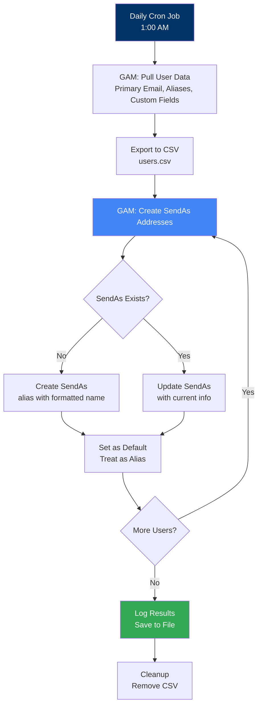
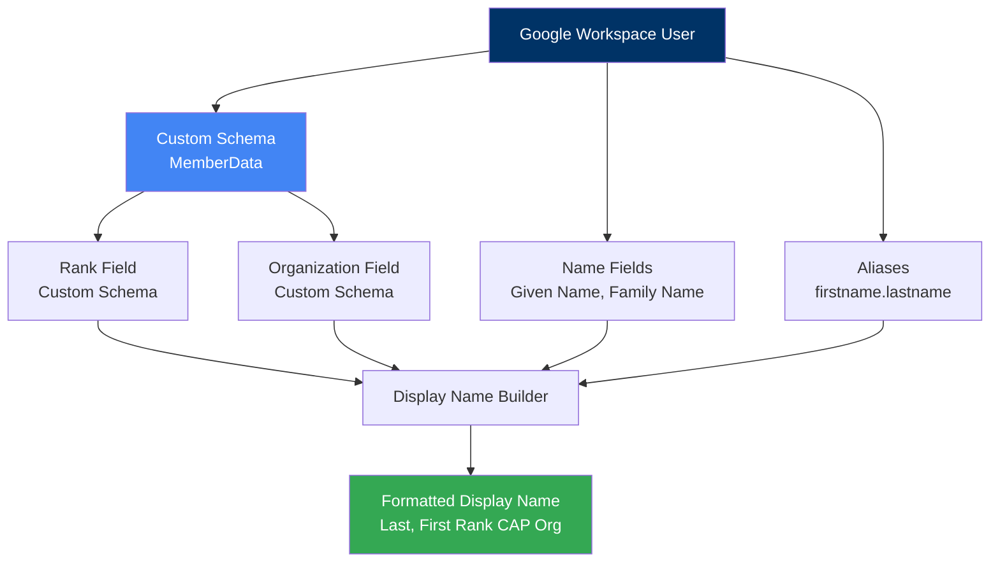

# Email Display Name Updates

> **Automated Google Workspace display name updates using GAM (Google Apps Manager)**

This utility updates member email display names daily using CAPWATCH data to ensure professional, consistent formatting across your wing's Google Workspace environment.

## Table of Contents

- [Overview](#overview)
- [Architecture](#architecture)
- [Prerequisites](#prerequisites)
- [Installation](#installation)
- [Configuration](#configuration)
- [Usage](#usage)
- [Scheduling](#scheduling)
- [Monitoring](#monitoring)
- [Troubleshooting](#troubleshooting)

## Overview

Google Workspace accounts created by the automation scripts use basic display names. This utility enhances them by:
- Adding member rank and organization to display names
- Creating professional SendAs addresses with rank formatting
- Updating display names daily from CAPWATCH data
- Maintaining consistency across all wing members

### What This Does

- Pulls member data from Google Workspace (including custom fields)
- Creates SendAs addresses for member aliases (firstname.lastname@domain)
- Formats display names as: "Last, First Rank CAP Organization"
- Updates existing SendAs addresses to reflect current rank/org
- Runs automatically via cron job

### Example Display Name Format

**Before**: John Doe
**After**: Doe, John Capt CAP GLR-MI-100

This format is professional, searchable, and includes all relevant member information at a glance.

## Architecture

### Display Name Update Flow



### SendAs Address Configuration

```mermaid
flowchart LR
    A[Member Account<br/>123456@miwg.cap.gov] --> B[Primary Email<br/>CAPID]
    A --> C[Alias<br/>john.doe@miwg.cap.gov]

    C --> D[SendAs Address<br/>john.doe@miwg.cap.gov]

    D --> E[Display Name<br/>Doe, John Capt CAP GLR-MI-100]

    E --> F[Default SendAs<br/>Treat as Alias]

    style A fill:#003366,color:#fff
    style C fill:#4285F4,color:#fff
    style E fill:#34A853,color:#fff
```

### Data Sources for Display Name



## Prerequisites

### Required

- **Google Workspace Account**: Domain administrator access
- **GAM (Google Apps Manager)**: Installed and configured
  - See [GAM Installation Guide](https://github.com/jay0lee/GAM)
- **Linux Server**: For running cron job (Ubuntu, Debian, RHEL, etc.)
  - Can use Azure VM, AWS EC2, or on-premises server
- **CAPWATCH Automation**: Member custom fields must be populated
  - Rank, Organization, etc. from UpdateMembers.gs

### Recommended

- Dedicated service account for GAM
- Basic Linux/cron knowledge
- Understanding of Google Workspace SendAs functionality

## Installation

### Step 1: Install GAM

Follow the official GAM installation guide:

```bash
# Download GAM installer
bash <(curl -s -S -L https://gam-shortn.appspot.com/gam-install)

# Follow prompts to authorize GAM with your Google Workspace
```

For detailed instructions, see: [GAM Installation](https://github.com/jay0lee/GAM/wiki)

### Step 2: Authorize GAM

Authorize GAM with your Google Workspace domain:

```bash
gam oauth create

# Follow the OAuth flow in your browser
# Grant necessary permissions
```

### Step 3: Verify GAM Access

Test GAM can access your users:

```bash
# List users in your domain
gam print users

# Should return list of users with email addresses
```

### Step 4: Create Working Directory

Create a directory for the script:

```bash
mkdir -p ~/gam-display-update
cd ~/gam-display-update
```

### Step 5: Create Update Script

Create the update script `update-display-names.sh`:

```bash
#!/bin/bash
# update-display-names.sh
# Updates Google Workspace display names with rank and organization

# Configuration
LOG_DIR="$HOME/gam-display-update/logs"
DATE=$(date +%Y-%m-%d)
LOG_FILE="$LOG_DIR/${DATE}_gam-job.log"

# Create log directory if it doesn't exist
mkdir -p "$LOG_DIR"

# Log start time
echo "=== Display Name Update Started: $(date) ===" | tee -a "$LOG_FILE"

# Step 1: Pull user information from Google Workspace
echo "Pulling user data..." | tee -a "$LOG_FILE"
gam print users primaryEmail aliases lastname firstname custom all \
    query orgUnitPath=/MI-001 > users.csv 2>&1 | tee -a "$LOG_FILE"

if [ $? -ne 0 ]; then
    echo "ERROR: Failed to pull user data" | tee -a "$LOG_FILE"
    exit 1
fi

# Step 2: Create SendAs addresses for all users
echo "Creating SendAs addresses..." | tee -a "$LOG_FILE"
gam csv users.csv gam user ~primaryEmail sendas ~aliases.0 \
    "~~name.familyName~~, ~~name.givenName~~ ~~customSchemas.MemberData.Rank~~ CAP ~~customSchemas.MemberData.Organization~~" \
    default treatasalias True 2>&1 | tee -a "$LOG_FILE"

# Step 3: Update existing SendAs addresses
echo "Updating SendAs addresses..." | tee -a "$LOG_FILE"
gam csv users.csv gam user ~primaryEmail update sendas ~aliases.0 name \
    "~~name.familyName~~, ~~name.givenName~~ ~~customSchemas.MemberData.Rank~~ CAP ~~customSchemas.MemberData.Organization~~" \
    default treatasalias True 2>&1 | tee -a "$LOG_FILE"

# Cleanup
echo "Cleaning up..." | tee -a "$LOG_FILE"
rm -f users.csv

# Log completion
echo "=== Display Name Update Completed: $(date) ===" | tee -a "$LOG_FILE"
echo "" | tee -a "$LOG_FILE"
```

Make the script executable:

```bash
chmod +x update-display-names.sh
```

## Configuration

### Custom Schema Fields

The script expects these custom schema fields (created by UpdateMembers.gs):

**Schema Name**: `MemberData`

**Fields**:
- `Rank` - Member rank (e.g., "Capt", "C/MSgt")
- `Organization` - Member organization (e.g., "GLR-MI-100")

### Organizational Unit Filter

The script includes an OU filter to target active members:

```bash
query orgUnitPath=/MI-001
```

**Customize for your wing**:
- `/MI-001` - Michigan Wing active members OU
- Change to match your wing's OU structure
- Remove `query` parameter to update all users

### Display Name Format

Current format: `Last, First Rank CAP Organization`

**To customize**, modify this line in the script:

```bash
"~~name.familyName~~, ~~name.givenName~~ ~~customSchemas.MemberData.Rank~~ CAP ~~customSchemas.MemberData.Organization~~"
```

**Examples**:
```bash
# Format: First Last (Rank) - Organization
"~~name.givenName~~ ~~name.familyName~~ (~~customSchemas.MemberData.Rank~~) - ~~customSchemas.MemberData.Organization~~"

# Format: Rank Last, First - Organization
"~~customSchemas.MemberData.Rank~~ ~~name.familyName~~, ~~name.givenName~~ - ~~customSchemas.MemberData.Organization~~"

# Format: Last, First Rank Organization (no CAP)
"~~name.familyName~~, ~~name.givenName~~ ~~customSchemas.MemberData.Rank~~ ~~customSchemas.MemberData.Organization~~"
```

## Usage

### Manual Execution

Run the script manually to test:

```bash
cd ~/gam-display-update
./update-display-names.sh
```

**Expected output**:
```
=== Display Name Update Started: 2024-12-15 01:00:00 ===
Pulling user data...
Getting all Users in the organization (may take some time on a large domain)...
Got 1250 Users...
Creating SendAs addresses...
Updating SendAs addresses...
Cleaning up...
=== Display Name Update Completed: 2024-12-15 01:15:23 ===
```

### Check Results

Verify updates in Google Workspace:

1. **Admin Console**:
   - Go to admin.google.com
   - Users → Select a user
   - Check Gmail settings → SendAs addresses

2. **Gmail**:
   - Log in as a member
   - Compose new email
   - Check "From" dropdown
   - Should show formatted display name

3. **GAM Command**:
   ```bash
   # Check specific user's SendAs addresses
   gam user john.doe@miwg.cap.gov show sendas
   ```

## Scheduling

### Set Up Cron Job

Schedule the script to run daily at 1:00 AM:

```bash
# Edit crontab
crontab -e

# Add this line:
0 1 * * * /home/username/gam-display-update/update-display-names.sh
```

**Cron Schedule Explanation**:
- `0 1 * * *` - Run at 1:00 AM every day
- Runs after CAPWATCH data download (4:00 AM) from previous day
- Updates display names before business hours

### Alternative Schedules

**Run at different time**:
```bash
# 2:00 AM daily
0 2 * * * /path/to/update-display-names.sh

# 11:00 PM daily
0 23 * * * /path/to/update-display-names.sh
```

**Run less frequently**:
```bash
# Weekly on Sunday at 1:00 AM
0 1 * * 0 /path/to/update-display-names.sh

# First day of month at 1:00 AM
0 1 1 * * /path/to/update-display-names.sh
```

### Verify Cron Job

Check cron job is scheduled:

```bash
# List all cron jobs
crontab -l

# Check cron service status
sudo systemctl status cron
```

## Monitoring

### Log Files

Logs are stored in `~/gam-display-update/logs/` with daily rotation:

```bash
# View today's log
cat ~/gam-display-update/logs/$(date +%Y-%m-%d)_gam-job.log

# View recent logs
ls -lh ~/gam-display-update/logs/

# Search for errors
grep -i error ~/gam-display-update/logs/*.log
```

### Log Rotation

Implement log rotation to manage disk space:

Create `/etc/logrotate.d/gam-display-update`:

```
/home/username/gam-display-update/logs/*.log {
    daily
    rotate 30
    compress
    delaycompress
    missingok
    notifempty
}
```

### Email Notifications

Get email notifications of cron job output:

```bash
# Edit crontab
crontab -e

# Add MAILTO at top
MAILTO=admin@example.com

# Cron job will email output if there are errors
0 1 * * * /path/to/update-display-names.sh
```

## Troubleshooting

### Common Issues

#### SendAs Not Being Created

**Symptom**: Users don't have SendAs addresses

**Possible Causes**:
- User has no alias (only CAPID email)
- GAM doesn't have permission
- API quota exceeded

**Solution**:
```bash
# Check if user has alias
gam info user john.doe@miwg.cap.gov | grep -i alias

# Verify GAM permissions
gam oauth info

# Check API quotas in Google Cloud Console
```

#### Display Name Not Updating

**Symptom**: Display name remains unchanged

**Possible Causes**:
- Custom schema fields not populated
- Wrong field names in script
- User manually changed their display name

**Solution**:
```bash
# Check custom fields for user
gam info user john.doe@miwg.cap.gov custom MemberData

# Should return Rank and Organization
# If empty, UpdateMembers.gs needs to run
```

#### Script Timing Out

**Symptom**: Script doesn't complete for large domains

**Possible Causes**:
- Too many users (1000+)
- API rate limiting
- Network issues

**Solution**:
```bash
# Process users in batches by OU
gam print users query orgUnitPath=/MI-001/MI-700 > group1-users.csv
gam csv group1-users.csv gam user ~primaryEmail ...

# Or add delays between operations
sleep 1  # Add after each gam command
```

#### Permission Errors

**Symptom**: "Insufficient permissions" error

**Possible Causes**:
- GAM not authorized for Gmail settings
- Service account needs more permissions

**Solution**:
```bash
# Re-authorize GAM with additional scopes
gam oauth create

# Ensure these scopes are enabled:
# - https://www.googleapis.com/auth/gmail.settings.basic
# - https://www.googleapis.com/auth/gmail.settings.sharing
```

## GAM Command Reference

### Pull User Data

```bash
# All users with custom fields
gam print users primaryEmail aliases lastname firstname custom all

# Specific OU only
gam print users query orgUnitPath=/MI-001 primaryEmail aliases custom MemberData

# Export to CSV
gam print users > users.csv
```

### Manage SendAs Addresses

```bash
# Create SendAs for single user
gam user john.doe@miwg.cap.gov sendas john.doe@miwg.cap.gov "Doe, John Capt CAP GLR-MI-100" default treatasalias true

# Update existing SendAs
gam user john.doe@miwg.cap.gov update sendas john.doe@miwg.cap.gov name "New Display Name"

# List user's SendAs addresses
gam user john.doe@miwg.cap.gov show sendas

# Delete SendAs address
gam user john.doe@miwg.cap.gov delete sendas john.doe@miwg.cap.gov
```

### Batch Operations with CSV

```bash
# Process CSV file
gam csv users.csv gam user ~primaryEmail <command>

# Example with field substitution
gam csv users.csv gam user ~primaryEmail sendas ~aliases.0 "~~name.familyName~~, ~~name.givenName~~"
```

## Additional Resources

- **[Main Project README](../../README.md)** - Overall automation documentation
- **[GAM GitHub Repository](https://github.com/jay0lee/GAM)** - Official GAM documentation
- **[GAM Wiki](https://github.com/jay0lee/GAM/wiki)** - Comprehensive command reference
- **[Google Workspace Admin SDK](https://developers.google.com/admin-sdk)** - API documentation
- **[SendAs Settings](https://support.google.com/mail/answer/22370)** - Gmail SendAs guide

---

**Questions?** Open an issue or discussion on GitHub.
