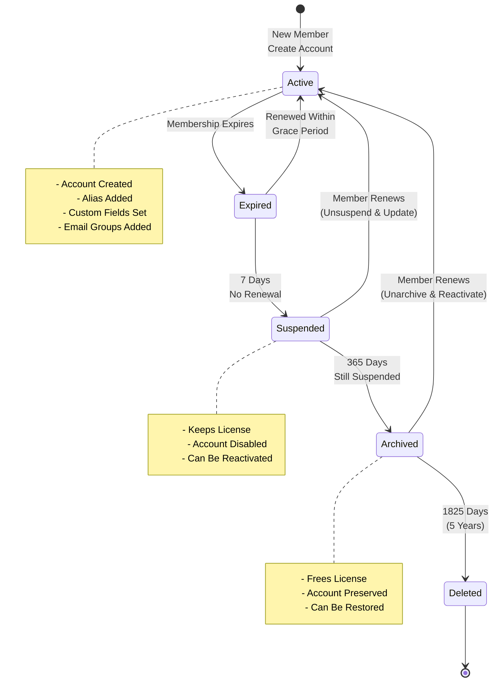
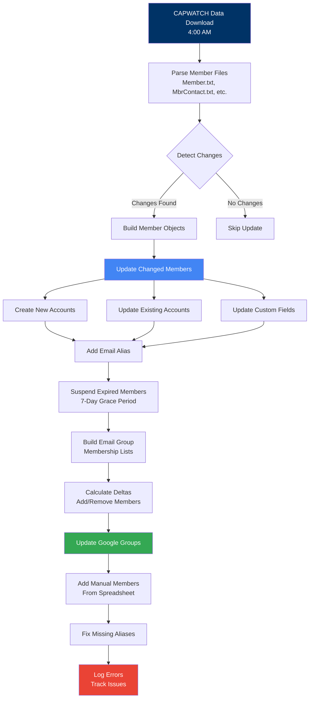
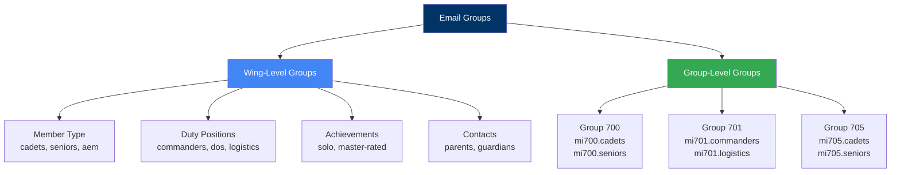
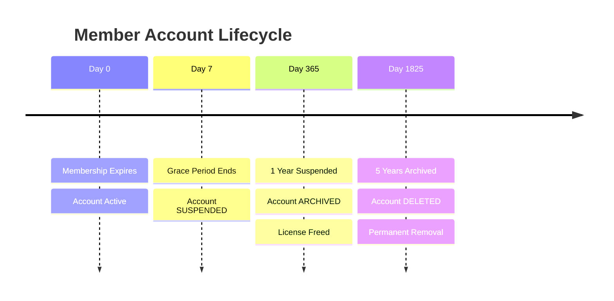

# Accounts & Email Groups Module

> **Automated management of Google Workspace user accounts and email distribution groups**

This module handles the core automation for synchronizing CAPWATCH member data with Google Workspace, managing the complete lifecycle of user accounts and email groups.

## Table of Contents

- [Overview](#overview)
- [Components](#components)
- [Architecture](#architecture)
- [How It Works](#how-it-works)
- [Configuration](#configuration)
- [Installation & Setup](#installation--setup)
- [Running the Automation](#running-the-automation)
- [Customization](#customization)
- [Troubleshooting](#troubleshooting)

## Overview

This module consists of three main components that work together to synchronize CAPWATCH membership data with your Google Workspace environment:

1. **UpdateMembers.gs** - User account lifecycle management
2. **UpdateGroups.gs** - Email group membership synchronization
3. **ManageLicenses.gs** - License optimization and account archival

Together, these scripts ensure that your Google Workspace environment stays synchronized with CAPWATCH membership data automatically.

### What This Module Does

- Creates and updates Google Workspace accounts for all active members
- Manages email aliases (firstname.lastname@domain)
- Maintains email distribution groups based on member attributes
- Suspends accounts for expired members (7-day grace period)
- Reactivates accounts for renewed members
- Archives long-suspended accounts to free licenses
- Deletes accounts inactive for 5+ years
- Tracks errors and problematic email addresses

## Components

### 1. UpdateMembers.gs - Member Account Management

**Purpose**: Manages the complete lifecycle of user accounts from creation to suspension.

**Key Functions**:
- `updateAllMembers()` - Main function to sync all member accounts
- `suspendExpiredMembers()` - Suspends accounts after 7-day grace period
- `reactivateRenewedMembers()` - Reactivates members who renewed
- `getMembers()` - Retrieves and processes CAPWATCH member data
- `addOrUpdateUser()` - Creates or updates a single user account

**What It Does**:
1. Reads CAPWATCH data from Drive (downloaded by GetCapwatch.gs)
2. Compares with previously saved data to detect changes
3. Updates only changed member accounts (efficient)
4. Creates new accounts with CAPID username and name alias
5. Suspends members who haven't renewed after grace period
6. Reactivates members who renewed (including archived members)
7. Updates custom schema fields (rank, organization, duty positions)
8. Sets recovery email to member's primary contact

### 2. UpdateGroups.gs - Email Group Automation

**Purpose**: Maintains email distribution groups based on member attributes.

**Key Functions**:
- `updateEmailGroups()` - Main function to sync all groups
- `getEmailGroupDeltas()` - Calculates membership changes
- `getGroupMembers()` - Builds group membership lists
- `updateAdditionalGroupMembers()` - Adds manual members from spreadsheet

**What It Does**:
1. Reads group configuration from automation spreadsheet
2. Builds desired group membership based on member attributes
3. Compares with current Google Group membership
4. Adds/removes members as needed
5. Creates groups automatically if they don't exist
6. Tracks problematic emails in "Error Emails" sheet

**Group Types Created**:

**Wing-Level Groups** (entire wing):
- `miwg.cadets@domain` - All cadets
- `miwg.seniors@domain` - All senior members
- `miwg.commanders@domain` - All commanders
- `miwg.operations@domain` - All operations officers
- `miwg.logistics@domain` - All logistics officers

**Group-Level Groups** (per group within wing):
- `mi700.cadets@domain` - Group 700 cadets
- `mi700.seniors@domain` - Group 700 seniors
- `mi705.commanders@domain` - Group 705 commanders

**Important**: Squadron-level groups are managed by the [Squadron Groups module](../squadron-groups/README.md) due to the large number of groups and runtime constraints.

### 3. ManageLicenses.gs - License Lifecycle Management

**Purpose**: Optimizes Google Workspace license usage by managing long-inactive accounts.

**Key Functions**:
- `manageLicenseLifecycle()` - Main monthly function
- `archiveLongSuspendedUsers()` - Archives users suspended 1+ year
- `deleteLongArchivedUsers()` - Deletes users archived 5+ years
- `reactivateSuspendedActiveUsers()` - Reactivates renewed members
- `previewLicenseLifecycle()` - Preview changes without applying

**What It Does**:
1. **Archive Phase** (1+ year suspended):
   - Finds members suspended over 1 year
   - Checks if active in CAPWATCH
   - Archives account (frees standard license)
   - Sends detailed report

2. **Delete Phase** (5+ years archived):
   - Finds members archived over 5 years
   - Checks if active in CAPWATCH
   - Permanently deletes account
   - Sends detailed report

3. **Reactivation**:
   - Automatically reactivates members who renewed
   - Unarchives and unsuspends in one step

## Architecture

### Member Account Lifecycle



### Daily Automation Flow



### Email Group Organization



### License Lifecycle Timeline



## How It Works

### Member Data Processing

The module processes CAPWATCH data through several stages:

**Stage 1: Parse CAPWATCH Files**
```javascript
getMembers() {
  - Parse Member.txt (basic info)
  - Parse MbrContact.txt (email addresses)
  - Parse DutyPosition.txt (senior duty positions)
  - Parse CadetDutyPositions.txt (cadet positions)
  - Validate all data
  - Return structured member objects
}
```

**Stage 2: Detect Changes**
```javascript
memberUpdated(newMember, previousMember) {
  - Compare rank
  - Compare charter
  - Compare duty positions
  - Compare status
  - Compare email
  - Return true if any changed
}
```

**Stage 3: Update Account**
```javascript
addOrUpdateUser(member) {
  - Try to update existing account
  - If not found, create new account
  - Add firstname.lastname alias
  - Set organizational unit
  - Update custom schema fields
  - Set recovery email
}
```

### Group Membership Calculation

**Step 1: Read Configuration**
```javascript
getEmailGroupDeltas() {
  - Read Groups sheet from spreadsheet
  - For each group configuration:
    - Build desired membership
    - Get current Google Group members
    - Calculate delta (add/remove)
  - Return delta object
}
```

**Step 2: Build Membership**
```javascript
getGroupMembers(groupName, attribute, values) {
  - Filter members by attribute
  - Match against specified values
  - Create wing-level group
  - Create group-level groups
  - Return member email lists
}
```

**Step 3: Apply Changes**
```javascript
updateEmailGroups() {
  - For each group:
    - Add new members
    - Remove old members
    - Track errors
  - Save error tracking to spreadsheet
}
```

## Configuration

### Required Spreadsheet Setup

Create a Google Sheets file with these tabs:

#### 1. Groups Sheet

Defines which email groups to create and maintain.

**Columns**:
- **Category** (A): Grouping for organization (e.g., `member-type`, `duty-position`)
- **Group Name** (B): Base group name without domain (e.g., `cadets`)
- **Attribute** (C): Member attribute to filter on
- **Values** (D): Comma-separated values to match

**Example Rows**:
```
Category        | Group Name    | Attribute           | Values
member-type     | cadets        | type                | CADET
member-type     | seniors       | type                | SENIOR
duty-position   | commanders    | dutyPositionIds     | CC
duty-position   | dos           | dutyPositionIds     | DO
achievement     | master-rated  | achievements        | MASTER
rank            | captains      | rank                | Capt
contact         | parents       | contact             | PRIMARY_CONTACT
```

**Supported Attributes**:
- `type` - Member type (CADET, SENIOR, AEM)
- `rank` - Member rank
- `dutyPositionIds` - Duty position codes
- `dutyPositionIdsAndLevel` - Position + level combination
- `dutyPositionLevel` - Position level only
- `achievements` - Member achievements
- `contact` - Contact types (for parent/guardian emails)

#### 2. User Additions Sheet

Allows manual additions to groups (non-CAPWATCH members or special roles).

**Columns**:
- **Name** (A): Person's name (for reference)
- **Email** (B): Email address to add
- **Role** (C): MEMBER, MANAGER, or OWNER
- **Groups** (D): Comma-separated group names (without domain)

**Use Cases**:
- Region-level members who live in your state
- Support personnel helping with specific duty positions
- External partners who need access to distribution lists
- Non-CAPWATCH accounts that should be in certain groups

**Example Rows**:
```
Name              | Email                  | Role    | Groups
John Doe (Region) | john.doe@cap.gov       | MEMBER  | miwg.staff,miwg.seniors
Deputy Commander  | cc@miwg.cap.gov        | MEMBER  | miwg.commanders
External Partner  | partner@agency.gov     | MEMBER  | miwg.emergency-services
```

#### 3. Error Emails Sheet

Auto-populated by the scripts when errors occur. Review this periodically.

**Auto-Created Columns**:
- Email address
- CAPID (if known)
- Error count
- Groups affected
- Error codes
- Last error message
- Categories
- First seen
- Last seen

### OrgPaths.txt Configuration

Create a CSV file in your CAPWATCH Data folder mapping CAPWATCH org IDs to Google Workspace Organizational Units:

```csv
ORGID,OrgUnitPath
223,/MI-001
1984,/MI-001/MI-700
2774,/MI-001/MI-705/MI-100
```

**Column Definitions**:
- **ORGID**: Organization ID from CAPWATCH Organization.txt file
- **OrgUnitPath**: Organizational Unit path from Google Workspace Admin Console
  - Wing HQ: `/MI-001`
  - Group: `/MI-001/MI-700`
  - Squadron: `/MI-001/MI-700/MI-101`

**Structure**: Wing → Group → Squadron hierarchy

### config.gs Settings

Key settings to adjust in `config.gs`:

```javascript
// Grace period before suspension
SUSPENSION_GRACE_DAYS: 7,

// Organizations to always suspend (transition units)
EXCLUDED_ORG_IDS: ['744', '1920'],

// Batch processing size
BATCH_SIZE: 50,

// License lifecycle settings
LICENSE_CONFIG: {
  DAYS_BEFORE_ARCHIVE: 365,    // 1 year
  DAYS_BEFORE_DELETE: 1825,     // 5 years
  MAX_BATCH_SIZE: 500,
  NOTIFICATION_EMAILS: [...]
}
```

## Installation & Setup

### Step 1: Enable Required APIs

Ensure these APIs are enabled in your Google Apps Script project:
- Admin SDK Directory API
- Google Groups API

### Step 2: Create Spreadsheet

1. Create a new Google Spreadsheet
2. Name it "CAPWATCH Automation Config"
3. Create three sheets: `Groups`, `User Additions`, `Error Emails`
4. Add header rows to each sheet
5. Note the spreadsheet ID from the URL
6. Update `AUTOMATION_SPREADSHEET_ID` in config.gs

### Step 3: Create OrgPaths.txt

1. Create a CSV file in your CAPWATCH Data folder
2. Map each CAPWATCH org ID to its Google Workspace OU path
3. Include wing, group, and squadron mappings
4. See example in `/examples` directory

### Step 4: Configure Groups

1. Open the automation spreadsheet
2. Go to the `Groups` sheet
3. Add rows for each email group you want to create
4. Use the examples above as a template

### Step 5: Test the Setup

Run test functions to verify configuration:

```javascript
// Test member retrieval
testGetMember();

// Test group configuration
testGetGroupMembers();

// Test single user update
testaddOrUpdateUser();
```

## Running the Automation

### Automated Schedule (Recommended)

Set up these time-based triggers in Google Apps Script:

| Time | Function | Frequency | Purpose |
|------|----------|-----------|---------|
| 5:00 AM | `updateAllMembers()` | Daily | Update member accounts |
| 5:00 AM | `suspendExpiredMembers()` | Daily | Suspend expired accounts |
| 5:00 AM | `updateEmailGroups()` | Daily | Update group memberships |
| 6:00 AM | `updateAdditionalGroupMembers()` | Daily | Add manual members |
| 6:00 AM | `updateMissingAliases()` | Daily | Fix missing aliases |
| 4:00 AM (15th) | `manageLicenseLifecycle()` | Monthly | Archive/delete old accounts |

### Manual Execution

Run functions manually from the Script Editor:

```javascript
// Update all members (full sync)
updateAllMembers();

// Just suspend expired members
suspendExpiredMembers();

// Update all email groups
updateEmailGroups();

// Add manual members from User Additions sheet
updateAdditionalGroupMembers();

// Preview license lifecycle changes (no modifications)
previewLicenseLifecycle();

// Run full license management
manageLicenseLifecycle();
```

### Testing Before Production

**Safe Testing Workflow**:

1. **Test with preview functions**:
   ```javascript
   previewLicenseLifecycle();
   ```

2. **Test with a single member**:
   ```javascript
   testaddOrUpdateUser();
   ```

3. **Reduce batch size for testing**:
   ```javascript
   // In config.gs
   BATCH_SIZE: 5
   ```

4. **Monitor execution logs**:
   - View → Executions in Apps Script
   - Check for errors
   - Review structured JSON logs

5. **Check Error Emails sheet**:
   - Review any problematic emails
   - Verify they're expected

6. **Run full sync when confident**:
   ```javascript
   updateAllMembers();
   updateEmailGroups();
   ```

## Customization

### Adding New Group Types

Want to create groups based on other criteria? Here's how:

1. **Add to Groups spreadsheet**:
   ```
   Category    | Group Name     | Attribute      | Values
   custom      | pilots         | achievements   | SOLO,PPL
   ```

2. **If using a new attribute**, add logic in `getGroupMembers()`:
   ```javascript
   case 'myCustomAttribute':
     for(const member in members) {
       if (members[member].myCustomAttribute === values[0]) {
         groups[wingGroupId][members[member].email] = 1;
       }
     }
     break;
   ```

### Custom Member Filtering

Want to exclude certain members? Add filtering logic:

```javascript
// In shouldProcessMember()
function shouldProcessMember(memberRow, types) {
  return memberRow[24] === 'ACTIVE' &&
         memberRow[13] != 0 &&
         memberRow[13] != 999 &&
         types.indexOf(memberRow[21]) > -1 &&
         // Add your custom filter here
         memberRow[someColumn] !== 'EXCLUDE';
}
```

### Changing Lifecycle Timelines

Adjust in `config.gs`:

```javascript
const LICENSE_CONFIG = {
  // Suspend → Archive: Change from 1 year to 6 months
  DAYS_BEFORE_ARCHIVE: 180,

  // Archive → Delete: Change from 5 years to 7 years
  DAYS_BEFORE_DELETE: 2555,

  // Process fewer accounts per run
  MAX_BATCH_SIZE: 100
};
```

## Troubleshooting

### Common Issues

#### Members Not Being Created

**Symptoms**: New CAPWATCH members don't get Google accounts

**Causes**:
1. Missing organizational unit path in OrgPaths.txt
2. Invalid email format in CAPWATCH
3. Authorization/permission issues

**Solutions**:
1. Check OrgPaths.txt has entry for member's org ID
2. Run `findMissingOrgPaths()` to identify missing mappings
3. Verify admin permissions in Google Workspace
4. Check execution logs for specific errors

#### Groups Not Updating

**Symptoms**: Group membership not matching CAPWATCH data

**Causes**:
1. Incorrect group configuration in spreadsheet
2. Group doesn't exist (should auto-create)
3. Permission issues

**Solutions**:
1. Verify Groups sheet configuration
2. Check that group names are correct (without @domain)
3. Run `getCurrentGroup('groupname')` to test
4. Review Error Emails sheet for specific failures

#### Email Addresses in Error Emails Sheet

**Symptoms**: Some email addresses consistently fail to add to groups

**Causes**:
1. External email addresses (not in your domain)
2. Invalid email format in CAPWATCH
3. Email doesn't exist
4. Group settings prevent external members

**Solutions**:
1. Review Error Emails sheet for specific error codes:
   - **404**: Email doesn't exist or group doesn't allow external
   - **400**: Invalid email format
   - **409**: Already a member (safe to ignore)
2. For external emails, check group settings in Admin Console
3. Clean up invalid emails in CAPWATCH

#### License Management Not Running

**Symptoms**: Old suspended accounts not being archived

**Causes**:
1. Trigger not set up
2. Monthly schedule missed
3. MAX_BATCH_SIZE limit reached

**Solutions**:
1. Verify monthly trigger exists for `manageLicenseLifecycle()`
2. Check trigger execution history
3. Run `previewLicenseLifecycle()` to see what would happen
4. Increase MAX_BATCH_SIZE if needed

#### Performance Issues / Timeouts

**Symptoms**: Functions timing out before completion

**Causes**:
1. Too many members to process in one execution
2. Google Apps Script 6-minute execution limit
3. API rate limiting

**Solutions**:
1. Reduce BATCH_SIZE in config.gs (default: 50)
2. Process in smaller batches
3. Add more delays with `Utilities.sleep()`
4. Split large operations across multiple triggers

### Debugging Tips

**Enable Detailed Logging**:
```javascript
// View logs in: View → Executions
Logger.info('Debug info', {
  variable: value,
  details: moreDetails
});
```

**Test Single Member**:
```javascript
function testaddOrUpdateUser() {
  let members = getMembers();
  if (members['123456']) {  // Your test CAPID
    addOrUpdateUser(members['123456']);
  }
}
```

**Check Data Files**:
```javascript
function debugFiles() {
  let members = parseFile('Member');
  Logger.info('Member count', { count: members.length });

  let contacts = parseFile('MbrContact');
  Logger.info('Contact count', { count: contacts.length });
}
```

**Preview Group Changes**:
```javascript
function previewGroups() {
  let deltas = getEmailGroupDeltas();

  for (const category in deltas) {
    for (const group in deltas[category]) {
      let adds = 0, removes = 0;
      for (const email in deltas[category][group]) {
        if (deltas[category][group][email] === 1) adds++;
        if (deltas[category][group][email] === -1) removes++;
      }
      console.log(`${group}: +${adds}, -${removes}`);
    }
  }
}
```

## Additional Resources

- **[Main README](../../README.md)** - Overall project documentation
- **[Squadron Groups Module](../squadron-groups/README.md)** - Squadron-level group management
- **[Recruiting & Retention Module](../recruiting-and-retention/README.md)** - Retention workflows
- **[API Reference](../../docs/API_REFERENCE.md)** - Detailed function documentation
- **[Development Guide](../../docs/DEVELOPMENT.md)** - Contributing guidelines

---

**Questions?** Open an issue or discussion on GitHub.
