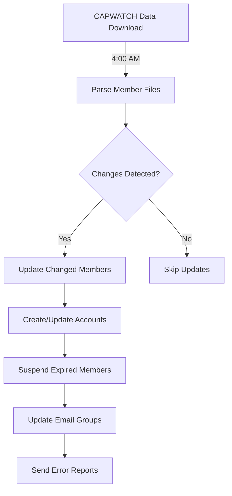

# Accounts & Email Groups Module

> **Automated management of Google Workspace user accounts and email distribution groups**

This module handles the core automation for synchronizing CAPWATCH member data with Google Workspace, managing the complete lifecycle of user accounts and email groups.

## Table of Contents

- [Overview](#overview)
- [Components](#components)
- [How It Works](#how-it-works)
- [Configuration](#configuration)
- [Running the Automation](#running-the-automation)
- [Understanding the Data Flow](#understanding-the-data-flow)
- [Customization](#customization)
- [Troubleshooting](#troubleshooting)

## Overview

This module consists of three main components:

1. **UpdateMembers.gs** - User account lifecycle management
2. **UpdateGroups.gs** - Email group membership synchronization
3. **ManageLicenses.gs** - License optimization and account archival

Together, these scripts ensure that your Google Workspace environment stays synchronized with CAPWATCH membership data automatically.

## Components

### 1. UpdateMembers.gs - Member Account Management

**Purpose**: Manages the complete lifecycle of user accounts from creation to suspension.

**Key Functions**:
- `updateAllMembers()` - Main function to sync all member accounts
- `suspendExpiredMembers()` - Suspends accounts after 7-day grace period
- `reactivateRenewedMembers()` - Reactivates members who renewed
- `getMembers()` - Retrieves and processes CAPWATCH member data
- `addOrUpdateUser()` - Creates or updates a single user account

**What It Does**:
1. Reads CAPWATCH data from Drive (downloaded by GetCapwatch.gs)
2. Compares with previously saved data to detect changes
3. Updates only changed member accounts (efficient)
4. Creates new accounts:
   - Username: CAPID (e.g., 123456@miwg.cap.gov)
   - Alias: firstname.lastname@miwg.cap.gov
5. Suspends members who haven't renewed after 7-day grace period
6. Reactivates members who renewed (including archived members)
7. Updates custom schema fields (rank, organization, duty positions)
8. Sets recovery email to member's primary contact from eServices

**Account Creation**:
```
New Member in CAPWATCH
    ↓
Create Google Account: 123456@miwg.cap.gov (CAPID as username)
    ↓
Add Alias: firstname.lastname@miwg.cap.gov
    ↓
Set Organization Unit: /MI-001/MI-700/MI-101 (Wing/Group/Squadron)
    ↓
Set Custom Fields: Rank, Charter, Positions
    ↓
Set Recovery Email: member's primary contact from eServices
```

**Suspension Logic**:
```
Member Expires in CAPWATCH (not in active files)
    ↓
Grace Period (7 days - CONFIG.SUSPENSION_GRACE_DAYS)
    ↓
Account Suspended (keeps license)
    ↓
If Renewed: Unsuspend + Update
If Not Renewed for 1 year: Archive (see ManageLicenses)
```

### 2. UpdateGroups.gs - Email Group Automation

**Purpose**: Maintains email distribution groups based on member attributes.

**Key Functions**:
- `updateEmailGroups()` - Main function to sync all groups
- `getEmailGroupDeltas()` - Calculates membership changes
- `getGroupMembers()` - Builds group membership lists
- `updateAdditionalGroupMembers()` - Adds manual members from spreadsheet

**What It Does**:
1. Reads group configuration from automation spreadsheet
2. Builds desired group membership based on member attributes
3. Compares with current Google Group membership
4. Adds/removes members as needed
5. Creates groups automatically if they don't exist
6. Tracks problematic emails in "Error Emails" sheet

**Group Types Created**:

**Wing-Level Groups** (entire wing):
- `miwg.cadets @<domain>` - All cadets
- `miwg.seniors @<domain>` - All senior members
- `miwg.commanders @<domain>` - All commanders
- `miwg.operations @<domain>` - All DOs (Duty Position ID filter)
- `miwg.logistics @<domain>` - All logistics officers
- `miwg.logistics.supply @<domain>` - All supply officers (sub-function)

**Group-Level Groups** (per group within wing):
- `mi700.cadets @<domain>` - Group 700 cadets
- `mi700.seniors @<domain>` - Group 700 seniors
- `mi705.commanders @<domain>` - Group 705 commanders
- `mi705.logistics.supply @<domain>` - Group 705 supply officers

**Important**: Squadron-level groups are NOT automatically created due to Google Apps Script runtime limits. Creating groups for every squadron would exceed the maximum execution time. Only wing-level and group-level distribution lists are automated.

**Email Naming Convention**:
```
[org-unit].[function].[sub-function]@domain

Examples:
- miwg.logistics @<domain> (wing-level, logistics function)
- miwg.logistics.supply @<domain> (wing-level, supply sub-function)
- mi705.logistics @<domain> (group-level, logistics function)
- mi705.logistics.supply @<domain> (group-level, supply sub-function)
```

**Attribute-Based Groups**:
You can create groups based on any member attribute:
- Member Type (CADET, SENIOR, AEM, etc.)
- Rank (Capt, Maj, Col, etc.)
- Duty Position IDs (DO, CC, CP, etc.)
- Duty Position Level (Squadron, Group, Wing)
- Achievements (Master, Senior, etc.)
- Contact Type (Emergency, Parent/Guardian)

**Group Configuration Example**:

| Category | Group Name | Attribute | Values |
|----------|-----------|-----------|--------|
| member-type | cadets | type | CADET |
| member-type | seniors | type | SENIOR |
| duty-position | commanders | dutyPositionIds | CC |
| duty-position | dos | dutyPositionIds | DO |
| achievement | solo-pilots | achievements | SOLO |
| contact | parents | contact | PRIMARY_CONTACT,EMERGENCY_CONTACT |

### 3. ManageLicenses.gs - License Lifecycle Management

**Purpose**: Optimizes Google Workspace license usage by managing long-inactive accounts.

**Key Functions**:
- `manageLicenseLifecycle()` - Main monthly function
- `archiveLongSuspendedUsers()` - Archives users suspended 1+ year
- `deleteLongArchivedUsers()` - Deletes users archived 5+ years
- `reactivateSuspendedActiveUsers()` - Reactivates renewed members
- `previewLicenseLifecycle()` - Preview changes without applying

**What It Does**:
1. **Archive Phase** (1+ year suspended):
   - Finds members suspended over 1 year
   - Checks if active in CAPWATCH
   - If not active: Archives account (frees standard license)
   - Sends detailed report

2. **Delete Phase** (5+ years archived):
   - Finds members archived over 5 years
   - Checks if active in CAPWATCH
   - If not active: Permanently deletes account
   - Sends detailed report

3. **Reactivation**:
   - Automatically reactivates members who renewed after suspension/archival
   - Unarchives and unsuspends in one step

**Lifecycle Timeline**:
```
Active Member
    ↓
Membership Expires
    ↓
7 Day Grace Period (CONFIG.SUSPENSION_GRACE_DAYS)
    ↓
SUSPENDED (keeps license)
    ↓
365 Days Suspended (LICENSE_CONFIG.DAYS_BEFORE_ARCHIVE)
    ↓
ARCHIVED (frees license → archived user license pool)
    ↓
1825 Days Archived (LICENSE_CONFIG.DAYS_BEFORE_DELETE)
    ↓
DELETED (permanent removal)
```

**Safety Features**:
- Preview mode to see what would change
- Maximum batch size limits (default: 100)
- Active member checks before deletion
- Detailed email reports
- Comprehensive logging

## How It Works

### Daily Member Sync Flow



### Member Data Processing

```javascript
// 1. Parse CAPWATCH files
getMembers() {
  - Parse Member.txt (basic info)
  - Parse MbrContact.txt (email addresses)
  - Parse DutyPosition.txt (duty positions)
  - Parse CadetDutyPositions.txt (cadet positions)
  - Validate all data
  - Return structured member objects
}

// 2. Detect changes
memberUpdated(newMember, previousMember) {
  - Compare rank
  - Compare charter
  - Compare duty positions
  - Compare status
  - Compare email
  - Return true if any changed
}

// 3. Update account
addOrUpdateUser(member) {
  - Try to update existing account
  - If not found, create new account
  - Add firstname.lastname alias
  - Set organizational unit
  - Update custom schema fields
  - Set recovery email
}
```

### Group Membership Calculation

```javascript
// 1. Read configuration
getEmailGroupDeltas() {
  - Read Groups sheet from spreadsheet
  - For each group configuration:
    - Build desired membership
    - Get current Google Group members
    - Calculate delta (add/remove)
  - Return delta object
}

// 2. Build membership
getGroupMembers(groupName, attribute, values) {
  - Filter members by attribute
  - Match against specified values
  - Create wing-level group
  - Create squadron-level groups
  - Return member email lists
}

// 3. Apply changes
updateEmailGroups() {
  - For each group:
    - Add new members
    - Remove old members
    - Track errors
  - Save error tracking to spreadsheet
}
```

## Configuration

### Required Spreadsheet Setup

Create a Google Sheets file with these tabs:

#### 1. Groups Sheet

Defines which email groups to create and maintain.

**Columns**:
- **Category** (A): Grouping for organization (e.g., `member-type`, `duty-position`)
- **Group Name** (B): Base group name without domain (e.g., `cadets`)
- **Attribute** (C): Member attribute to filter on
- **Values** (D): Comma-separated values to match

**Example Rows**:
```
Category        | Group Name    | Attribute           | Values
member-type     | cadets        | type                | CADET
member-type     | seniors       | type                | SENIOR
member-type     | aem           | type                | AEM
duty-position   | commanders    | dutyPositionIds     | CC
duty-position   | dos           | dutyPositionIds     | DO
duty-position   | ops-officers  | dutyPositionIds     | DO,ADO
achievement     | master-rated  | achievements        | MASTER
rank            | captains      | rank                | Capt
contact         | parents       | contact             | PRIMARY_CONTACT
```

#### 2. User Additions Sheet

Allows manual additions to groups (non-CAPWATCH members or special roles).

**Columns**:
- **Name** (A): Person's name (for reference)
- **Email** (B): Email address to add
- **Role** (C): MEMBER, MANAGER, or OWNER
- **Groups** (D): Comma-separated group names (without domain)

**Use Cases**:
- **Region-level members** who live in your state and want to receive wing communications
- **Support personnel** helping with specific duty positions who want to monitor/assist
- **External partners** who need access to specific distribution lists
- **Non-CAPWATCH accounts** that should be in certain groups

**Example Rows**:
```
Name              | Email                  | Role    | Groups
John Doe (Region) | john.doe@cap.gov       | MEMBER  | miwg.staff,miwg.seniors
Deputy Commander  | cc@miwg.cap.gov        | MEMBER  | miwg.commanders,mi700.commanders
External Partner  | partner@agency.gov     | MEMBER  | miwg.emergency-services
```

#### 3. Error Emails Sheet

Auto-populated by the scripts when errors occur. Review this periodically.

**Columns** (created automatically):
- Email address
- CAPID (if known)
- Error count
- Groups affected
- Error codes
- Last error message
- Categories
- First seen
- Last seen

### OrgPaths.txt Configuration

Create a CSV file in your CAPWATCH Data folder mapping CAPWATCH org IDs to Google Workspace Organizational Units:

```csv
ORGID,OrgUnitPath
223,/MI-001
1984,/MI-001/MI-700
2774,/MI-001/MI-705/MI-100
```

**Column Definitions**:
- **ORGID**: Organization ID from CAPWATCH Organization.txt file
- **OrgUnitPath**: Organizational Unit path from Google Workspace Admin Console
  - Wing HQ: `/MI-001`
  - Group: `/MI-001/MI-700` (Group 700)
  - Squadron: `/MI-001/MI-700/MI-101` (Squadron 101 in Group 700)

**Structure**: Wing → Group → Squadron hierarchy
- `/` = Root of Google Workspace (miwg.cap.gov)
- `/MI-001` = Wing organizational unit
- `/MI-001/MI-700` = Group 700 under Wing
- `/MI-001/MI-700/MI-100` = Squadron 100 under Group 700

**Note**: See `/examples/OrgPaths-Example.txt` for a complete working example.

### config.gs Settings

Key settings to adjust in `config.gs`:

```javascript
// Grace period before suspension
SUSPENSION_GRACE_DAYS: 7,

// Organizations to always suspend (transition units)
EXCLUDED_ORG_IDS: ['744', '1920'],

// Batch processing size
BATCH_SIZE: 50,

// License lifecycle settings
LICENSE_CONFIG: {
  DAYS_BEFORE_ARCHIVE: 365,    // 1 year
  DAYS_BEFORE_DELETE: 1825,     // 5 years
  MAX_BATCH_SIZE: 500,
  NOTIFICATION_EMAILS: [...]
}
```

## Running the Automation

### Automated Schedule (Recommended)

Set up these time-based triggers in Google Apps Script:

| Time | Function | Frequency | Purpose |
|------|----------|-----------|---------|
| 4:00 AM | `getCapwatch()` | Daily | Download CAPWATCH data |
| 5:00 AM | `updateAllMembers()` | Daily | Update member accounts |
| 5:00 AM | `suspendExpiredMembers()` | Daily | Suspend expired accounts |
| 5:00 AM | `updateEmailGroups()` | Daily | Update group memberships |
| 6:00 AM | `updateAdditionalGroupMembers()` | Daily | Update additional group memberships from spreadsheet |
| 6:00 AM | `updateMissingAliases()` | Daily | Update missing email eliases |
| 4:00 AM (15th) | `manageLicenseLifecycle()` | Monthly | Archive/delete old accounts |

### Manual Execution

Run functions manually from the Script Editor:

```javascript
// Test with a single member
testaddOrUpdateUser();

// Update all members (full sync)
updateAllMembers();

// Just suspend expired members
suspendExpiredMembers();

// Update all email groups
updateEmailGroups();

// Add manual members from User Additions sheet
updateAdditionalGroupMembers();

// Preview license lifecycle changes (no modifications)
previewLicenseLifecycle();

// Run full license management
manageLicenseLifecycle();
```

### Testing Before Production

**Safe Testing Workflow**:

1. **Test with preview functions** (no changes):
   ```javascript
   previewLicenseLifecycle();
   ```

2. **Test with a single member**:
   ```javascript
   // Edit testaddOrUpdateUser() to use your test member
   testaddOrUpdateUser();
   ```

3. **Reduce batch size for testing**:
   ```javascript
   // In config.gs
   BATCH_SIZE: 5,
   MAX_BATCH_SIZE: 10
   ```

4. **Monitor execution logs**:
   - View → Executions in Apps Script
   - Check for errors
   - Review structured JSON logs

5. **Check Error Emails sheet**:
   - Review any problematic emails
   - Verify they're expected

6. **Run full sync when confident**:
   ```javascript
   updateAllMembers();
   updateEmailGroups();
   ```

## Understanding the Data Flow

### Member Data Sources

The automation pulls data from multiple CAPWATCH files:

```
Member.txt
├── CAPID, Name, Rank, Type, Status
├── Joined Date, Expiration Date
└── Organization ID

MbrContact.txt
├── Email addresses (PRIMARY)
├── Phone numbers
└── Emergency contacts

DutyPosition.txt (Senior Members)
├── Duty Position ID (CC, DO, etc.)
├── Position Level (Squadron, Group, Wing)
├── Assistant/Primary flag
└── Organization assignment

CadetDutyPositions.txt (Cadets)
├── Cadet Position ID
├── Position Level
└── Organization assignment

MbrAchievements.txt
├── Achievement Name
├── Status (ACTIVE/TRAINING)
└── Completion Date

Organization.txt
├── Organization ID
├── Charter Number
├── Unit Number
└── Organization Hierarchy
```

### Custom Schema Fields

Each Google Workspace account stores CAPWATCH data in custom schema:

```javascript
customSchemas: {
  MemberData: {
    CAPID: "123456",
    Rank: "Capt",
    Organization: "GLR-MI-100",
    DutyPosition: [
      "DO (P) (GLR-MI-100)",
      "CP (A) (GLR-MI-223)"
    ],
    Type: "SENIOR",
    LastUpdated: "2024-12-15"
  }
}
```

### Organizational Structure

```
/ (root: miwg.cap.gov)
└── MI-001 (Wing - Active Members)
    │
    ├── MI-700 (Group 700)
    │   ├── MI-101 (Squadron)
    │   ├── MI-201 (Squadron)
    │   └── ...
    ├── MI-701 (Group 701)
    │   ├── MI-075 (Squadron)
    │   ├── MI-165 (Squadron)
    │   └── ...
    └── ...
```

### Email Group Hierarchy

```
Wing-Level Groups:
- miwg.all-members <@domain>
- miwg.cadets <@domain>
- miwg.seniors <@domain>
- miwg.commanders <@domain>

Group-Level Groups (auto-created per group):
- mi700.cadets <@domain>
- mi700.seniors <@domain>
- mi705.commanders <@domain>

Special Groups:
- miwg.parents <@domain> (from contact data)
```

**Note**: Squadron-level groups are not automatically created due to Google Apps Script runtime limitations.

## Customization

### Adding New Group Types

Want to create groups based on other criteria? Here's how:

1. **Add to Groups spreadsheet**:
   ```
   Category    | Group Name     | Attribute  | Values
   custom      | pilots         | achievements | SOLO,PPL
   ```

2. **If using a new attribute**, add logic in `getGroupMembers()`:
   ```javascript
   case 'myCustomAttribute':
     for(const member in members) {
       if (members[member].myCustomAttribute === values[0]) {
         groups[wingGroupId][members[member].email] = 1;
       }
     }
     break;
   ```

### Custom Member Filtering

Want to exclude certain members? Add filtering logic:

```javascript
// In shouldProcessMember()
function shouldProcessMember(memberRow, types) {
  return memberRow[24] === 'ACTIVE' && 
         memberRow[13] != 0 &&  // Not org 000
         memberRow[13] != 999 &&  // Not org 999
         types.indexOf(memberRow[21]) > -1 &&
         // Add your custom filter here
         memberRow[someColumn] !== 'EXCLUDE';
}
```

### Changing Lifecycle Timelines

Adjust in `config.gs`:

```javascript
const LICENSE_CONFIG = {
  // Suspend → Archive: Change from 1 year to 6 months
  DAYS_BEFORE_ARCHIVE: 180,
  
  // Archive → Delete: Change from 5 years to 7 years
  DAYS_BEFORE_DELETE: 2555,
  
  // Process fewer accounts per run
  MAX_BATCH_SIZE: 100
};
```

### Custom Duty Position Formatting

Want to change how duty positions are displayed?

```javascript
// In addDutyPositions()
members[dutyPositionData[i][0]].dutyPositions.push({
  // Change this format string:
  value: Utilities.formatString("%s (%s) (%s)", 
    dutyPositionID, 
    (dutyPositionData[i][4] == '1' ? 'Assistant' : 'Primary'),  // Changed
    squadrons[dutyPositionData[i][7]].charter
  ),
  id: dutyPositionID,
  level: dutyPositionData[i][3],
  assistant: dutyPositionData[i][4] == '1'
});
```

## Troubleshooting

### Common Issues

#### Members Not Being Created

**Symptoms**: New CAPWATCH members don't get Google accounts

**Causes**:
1. Missing organizational unit path in OrgPaths.txt
2. Invalid email format in CAPWATCH
3. Authorization/permission issues

**Solutions**:
1. Check OrgPaths.txt has entry for member's org ID
2. Run `findMissingOrgPaths()` to identify missing mappings
3. Verify admin permissions in Google Workspace
4. Check execution logs for specific errors

#### Groups Not Updating

**Symptoms**: Group membership not matching CAPWATCH data

**Causes**:
1. Incorrect group configuration in spreadsheet
2. Group doesn't exist (should auto-create)
3. Permission issues

**Solutions**:
1. Verify Groups sheet configuration
2. Check that group names are correct (without @domain)
3. Run `getCurrentGroup('groupname')` to test
4. Review Error Emails sheet for specific failures

#### Email Addresses in Error Emails Sheet

**Symptoms**: Some email addresses consistently fail to add to groups

**Causes**:
1. External email addresses (not in your domain)
2. Invalid email format in CAPWATCH
3. Email doesn't exist
4. Group settings prevent external members

**Solutions**:
1. Review Error Emails sheet for specific error codes:
   - **404**: Email doesn't exist or group doesn't allow external
   - **400**: Invalid email format
   - **409**: Already a member (safe to ignore)
2. For external emails, check group settings in Admin Console
3. Clean up invalid emails in CAPWATCH

#### License Management Not Running

**Symptoms**: Old suspended accounts not being archived

**Causes**:
1. Trigger not set up
2. Monthly schedule missed
3. MAX_BATCH_SIZE limit reached

**Solutions**:
1. Verify monthly trigger exists for `manageLicenseLifecycle()`
2. Check trigger execution history
3. Run `previewLicenseLifecycle()` to see what would happen
4. Increase MAX_BATCH_SIZE if needed

#### Performance Issues / Timeouts

**Symptoms**: Functions timing out before completion

**Causes**:
1. Too many members to process in one execution
2. Google Apps Script 6-minute execution limit
3. API rate limiting

**Solutions**:
1. Reduce BATCH_SIZE in config.gs (default: 50)
2. Process in smaller batches
3. Add more delays with `Utilities.sleep()`
4. Split large operations across multiple triggers

### Debugging Tips

**Enable Detailed Logging**:
```javascript
// The Logger object already provides structured logging
// View logs in: View → Executions
Logger.info('Debug info', { 
  variable: value,
  details: moreDetails 
});
```

**Test Single Member**:
```javascript
// Edit function to test specific CAPID
function testaddOrUpdateUser() {
  let members = getMembers();
  if (members['123456']) {  // Your test CAPID
    addOrUpdateUser(members['123456']);
  }
}
```

**Check Data Files**:
```javascript
// View what's in CAPWATCH files
function debugFiles() {
  let members = parseFile('Member');
  Logger.info('Member count', { count: members.length });
  
  let contacts = parseFile('MbrContact');
  Logger.info('Contact count', { count: contacts.length });
}
```

**Preview Group Changes**:
```javascript
// See what would change without applying
function previewGroups() {
  let deltas = getEmailGroupDeltas();
  
  for (const category in deltas) {
    for (const group in deltas[category]) {
      let adds = 0, removes = 0;
      for (const email in deltas[category][group]) {
        if (deltas[category][group][email] === 1) adds++;
        if (deltas[category][group][email] === -1) removes++;
      }
      console.log(`${group}: +${adds}, -${removes}`);
    }
  }
}
```

### Getting Help

If you encounter issues not covered here:

1. Check the main [Troubleshooting Guide](../../docs/TROUBLESHOOTING.md)
2. Review execution logs in Apps Script
3. Check Error Emails sheet for patterns
4. Search [GitHub Issues](https://github.com/yourusername/capwatch-automation/issues)
5. Open a new issue with:
   - What you're trying to do
   - Error messages from logs
   - Relevant configuration
   - Steps to reproduce

---

## Additional Resources

- **[Main README](../../README.md)** - Overall project documentation
- **[API Reference](../../docs/API_REFERENCE.md)** - Detailed function documentation
- **[Utilities Guide](../../docs/UTILITIES.md)** - Shared helper functions
- **[Development Guide](../../docs/DEVELOPMENT.md)** - Contributing guidelines

**Questions?** Open an issue or discussion on GitHub.