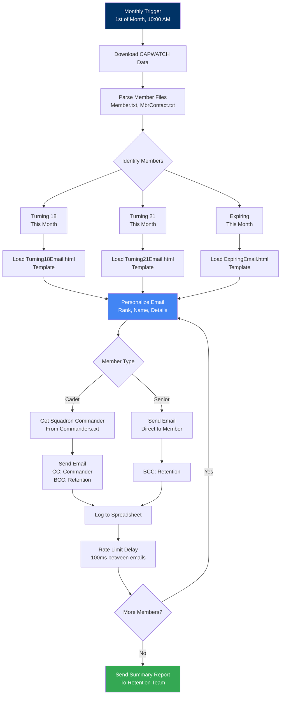
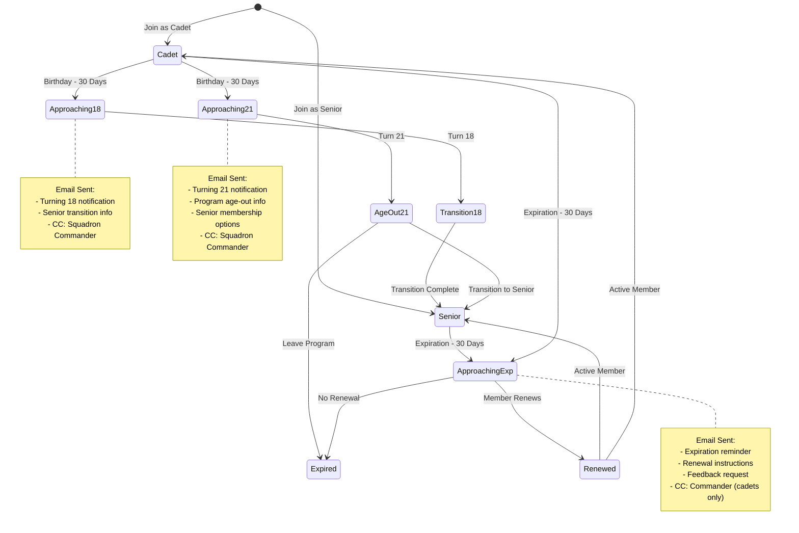

# Recruiting & Retention Module

> **Automated email system for CAP member retention, sending personalized emails to members at key lifecycle points**

This module automatically identifies and emails CAP members who are approaching important milestones in their membership lifecycle, helping your wing maintain engagement and improve retention rates.

## Table of Contents

- [Overview](#overview)
- [Architecture](#architecture)
- [Features](#features)
- [Email Types](#email-types)
- [Installation & Setup](#installation--setup)
- [Configuration](#configuration)
- [Usage](#usage)
- [Monitoring](#monitoring)
- [Troubleshooting](#troubleshooting)
- [Best Practices](#best-practices)

## Overview

This module automatically identifies and emails CAP members who are:
- **Turning 18** - Cadets transitioning to senior member eligibility
- **Turning 21** - Cadets aging out of the cadet program
- **Expiring** - Members whose membership expires this month

Emails are personalized with member rank/name and include squadron commanders on cadet emails for awareness and follow-up support.

### What This Module Does

- Automatically identifies members at key lifecycle points
- Sends personalized emails with member-specific information
- CC's squadron commanders on cadet transition emails
- BCC's retention team for tracking
- Logs all communications to spreadsheet
- Sends summary report to retention team
- Handles rate limiting to prevent Gmail quota issues

## Architecture

### Email Automation Flow



### Member Lifecycle Tracking



## Features

- **Automated Member Identification**: Identifies members based on CAPWATCH data
- **Personalized Email Templates**: Uses rank and name in email content
- **Squadron Commander CC**: Keeps commanders informed of cadet transitions
- **Comprehensive Logging**: Tracks all sent emails in spreadsheet
- **Summary Reporting**: Emails retention team with monthly summary
- **Error Tracking**: Handles and logs email sending failures
- **Rate Limiting**: Prevents Gmail quota issues with delays
- **BCC Tracking**: BCC's retention team for visibility

## Email Types

### 1. Turning 18 Email

**Template:** `Turning18Email.html`
**Recipients:** Active cadets turning 18 this month
**CC:** Squadron Commander
**BCC:** Retention Team
**Purpose:** Inform cadet about transition to senior member opportunities

**Key Information Included:**
- Senior member benefits and opportunities
- Continuation options in the cadet program
- How to transition to senior membership
- Resources for decision-making

### 2. Turning 21 Email

**Template:** `Turning21Email.html`
**Recipients:** Active cadets turning 21 this month
**CC:** Squadron Commander
**BCC:** Retention Team
**Purpose:** Inform cadet about aging out of cadet program and senior membership

**Key Information Included:**
- Cadet program age-out information
- Senior membership opportunities
- How to continue service in CAP
- Leadership opportunities for former cadets

### 3. Expiring Membership Email

**Template:** `ExpiringEmail.html`
**Recipients:** Active cadets and seniors expiring this month
**CC:** Squadron Commander (cadets only)
**BCC:** Retention Team
**Purpose:** Remind member to renew membership before expiration

**Key Information Included:**
- Expiration date
- Renewal instructions
- Benefits of continued membership
- Feedback request if not renewing

## Installation & Setup

### Step 1: Create Email Templates

Create three HTML email templates in your Google Apps Script project:

1. **Turning18Email.html** - Template for cadets turning 18
2. **Turning21Email.html** - Template for cadets turning 21
3. **ExpiringEmail.html** - Template for expiring members

Each template should include the following placeholders:
- `{{rank}}` - Member's rank
- `{{lastName}}` - Member's last name
- `{{expiration}}` - Expiration date (ExpiringEmail only)

**Example template structure:**
```html
<!DOCTYPE html>
<html>
<head>
  <style>
    body { font-family: Arial, sans-serif; line-height: 1.6; }
    .header { background-color: #003366; color: white; padding: 20px; }
    .content { padding: 20px; }
    .footer { background-color: #f4f4f4; padding: 10px; text-align: center; }
  </style>
</head>
<body>
  <div class="header">
    <h1>Important Membership Update</h1>
  </div>
  <div class="content">
    <p>Dear {{rank}} {{lastName}},</p>

    <p>[Email content here]</p>

    <p>If you have any questions, please don't hesitate to contact your unit leadership or the wing retention team.</p>

    <p>Semper Vigilans,</p>
    <p>[Your Name]<br>
    Director of Recruiting & Retention<br>
    [Your Wing], Civil Air Patrol</p>
  </div>
  <div class="footer">
    <p>This is an automated message from the [Wing] Retention Team</p>
  </div>
</body>
</html>
```

### Step 2: Configure Settings

Update the following values in `config.gs`:

```javascript
// Retention tracking spreadsheet
const RETENTION_LOG_SPREADSHEET_ID = '<your-spreadsheet-id>';

// Email addresses
const RETENTION_EMAIL = 'retention@domain';
const DIRECTOR_RECRUITING_EMAIL = 'director.rr@domain';
const AUTOMATION_SENDER_EMAIL = 'retention.workflows@domain';
const SENDER_NAME = 'Your Name, Director of Recruiting & Retention';

// Test email for development
const TEST_EMAIL = 'test.email@domain';

// IT support contact
const ITSUPPORT_EMAIL = 'it@domain';
```

### Step 3: Create Retention Log Spreadsheet

1. Create a new Google Spreadsheet
2. Name it "Retention Email Log" (or similar)
3. Copy the spreadsheet ID from the URL
4. Update `RETENTION_LOG_SPREADSHEET_ID` in config.gs

The script will automatically create a "Log" sheet with the following columns:
- Timestamp
- Email Type
- CAPID
- Name
- Email
- Commander CAPID
- Commander Name
- Commander Email

### Step 4: Verify CAPWATCH Data Files

Ensure the following CAPWATCH files are available in your configured folder:
- `Member.txt` - Member data
- `MbrContact.txt` - Contact information
- `Commanders.txt` - Squadron commander assignments

### Step 5: Test the System

Run the test functions to verify everything works:

```javascript
// Test 1: Preview member counts without sending emails
testRetentionEmail();

// Test 2: Send test emails using real member data (sent to TEST_EMAIL)
testAllRetentionEmails();
```

Review test emails to verify:
- Templates render correctly
- Placeholders are replaced with actual data
- Email formatting looks professional
- Reply-to and sender settings are correct

### Step 6: Set Up Trigger

1. Open the Apps Script editor
2. Click on the clock icon (Triggers) in the left sidebar
3. Click "+ Add Trigger" in the bottom right
4. Configure the trigger:
   - **Function:** `sendRetentionEmails`
   - **Deployment:** Head
   - **Event source:** Time-driven
   - **Type:** Month timer
   - **Day of month:** 1
   - **Time of day:** 10am to 11am
5. Click "Save"

**Why 10am?** Emails arrive mid-morning when members are likely to check email, maximizing engagement.

**Why the 1st?** Ensures CAPWATCH data is updated after month-end processing and gives members advance notice.

## Configuration

### RETENTION_CONFIG Object

```javascript
const RETENTION_CONFIG = {
  // Email subject lines
  SUBJECTS: {
    TURNING_18: 'Important Membership Update - Turning 18',
    TURNING_21: 'Important Membership Update - Turning 21',
    EXPIRING: 'Your CAP Membership Expires Soon'
  },

  // Age thresholds for triggers
  AGE_THRESHOLDS: {
    TRANSITION_TO_SENIOR: 18,  // Cadets turning 18
    CADET_AGE_OUT: 21          // Cadets turning 21
  },

  // Rate limiting (milliseconds between emails)
  EMAIL_DELAY_MS: 100,

  // Progress logging (log every N emails)
  PROGRESS_LOG_INTERVAL: 10
};
```

### Gmail Quotas

Be aware of Google Workspace email quotas:

| Account Type | Daily Limit |
|--------------|-------------|
| Personal Gmail | 100 emails/day |
| Google Workspace | 1,500 emails/day |
| Google Workspace (high-volume) | 10,000 emails/day |

With 100ms delay between emails:
- 10 emails = ~1 second
- 100 emails = ~10 seconds
- 1,000 emails = ~100 seconds (~1.7 minutes)

The script should complete well within execution time limits.

## Usage

### Automatic Execution

Once the trigger is configured, the system runs automatically on the 1st of each month at 10am. It will:

1. Download fresh CAPWATCH data
2. Identify members in each category
3. Send personalized emails
4. Log all sends to spreadsheet
5. Email summary report to retention team

### Manual Execution

You can also run the system manually:

```javascript
// Run full retention email process
sendRetentionEmails();
```

This is useful for:
- Testing after configuration changes
- Sending emails on a different schedule
- Re-sending if there was an issue

## Monitoring

### Execution Logs

View execution logs in Google Apps Script:
1. Open the script editor
2. Click "Executions" in the left sidebar
3. Review status, duration, and any errors

### Email Log Spreadsheet

Track all sent emails in the retention log spreadsheet:
- View who received emails and when
- See which commander was CC'd
- Identify patterns in member lifecycles
- Export data for retention metrics

### Summary Email

The retention team receives a summary email after each run with:
- Total emails sent by category
- Failed sends (if any)
- Processing duration
- Breakdown by email type

## Troubleshooting

### No Members Found

**Symptom:** "Found 0 members" in logs

**Possible Causes:**
- CAPWATCH data not updated
- No members match criteria this month
- Date parsing issues

**Solution:**
```javascript
// Run test to see member data
testRetentionEmail();

// Check logs for warnings about invalid dates
```

### Template Not Found

**Symptom:** "Template file not found" error

**Possible Causes:**
- HTML file not created in Apps Script project
- Filename doesn't match exactly (case-sensitive)

**Solution:**
1. Verify files exist: `Turning18Email.html`, `Turning21Email.html`, `ExpiringEmail.html`
2. Check for typos in filenames
3. Ensure files are in the same project

### Emails Not Sending

**Symptom:** Members not receiving emails

**Possible Causes:**
- Invalid email addresses in CAPWATCH
- Gmail quota exceeded
- Sender authorization issues

**Solution:**
```javascript
// Check for email validation warnings in logs
// Look for "No valid email" messages

// Verify email quotas
// https://support.google.com/mail/answer/22839
```

### Commander Not CC'd

**Symptom:** Squadron commander not included on email

**Possible Causes:**
- Commander not listed in Commanders.txt
- Commander has no email in MbrContact.txt
- Wrong orgid assignment

**Solution:**
```javascript
// Test commander lookup
let commander = getCommanderInfo('2503'); // Use actual orgid
console.log(JSON.stringify(commander, null, 2));
```

### Rate Limiting Issues

**Symptom:** "Rate limit exceeded" errors

**Possible Causes:**
- Too many emails sent too quickly
- Other scripts also sending emails

**Solution:**
- Default delay is 100ms between emails
- Increase delay in `RETENTION_CONFIG.EMAIL_DELAY_MS`
- Spread execution across multiple hours

## Best Practices

### Template Design
- Keep emails concise and actionable
- Include clear next steps for member
- Provide contact information for questions
- Use professional CAP branding
- Test on mobile devices

### Timing
- Run on the 1st after CAPWATCH updates
- Send at 10am for optimal open rates
- Avoid holidays/weekends if possible
- Give advance notice for expirations

### Monitoring
- Review logs monthly for errors
- Check email delivery rates
- Monitor member response/engagement
- Update templates based on feedback

### Testing
- Test after any template changes
- Verify data accuracy before production
- Send test emails to yourself first
- Review all three email types

### Data Privacy

This system processes member personal information:
- Email addresses stored securely in CAPWATCH
- Logs stored in private spreadsheet (restricted access)
- No data shared outside organization
- Members can opt out via email preferences
- Comply with CAP privacy policies

## Additional Resources

- **[Main README](../../README.md)** - Overall project documentation
- **[Accounts & Groups Module](../accounts-and-groups/README.md)** - Member account management
- **[Squadron Groups Module](../squadron-groups/README.md)** - Squadron-level groups
- **[API Reference](../../docs/API_REFERENCE.md)** - Detailed function documentation
- **[Development Guide](../../docs/DEVELOPMENT.md)** - Contributing guidelines

---

**Questions?** Open an issue or discussion on GitHub.
