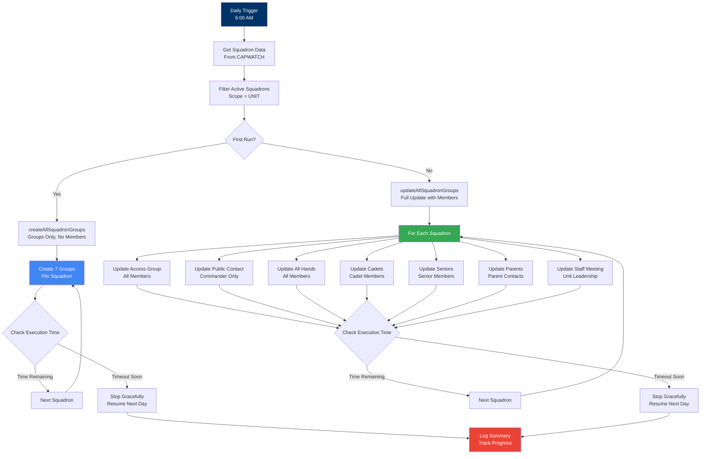
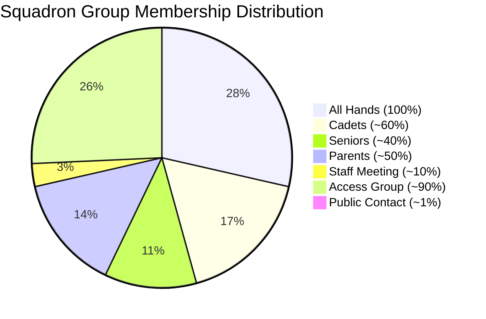

# Squadron Groups Module

> **Automated management of squadron-level Google Groups for unit collaboration and communication**

This module creates and maintains squadron-specific Google Groups that facilitate internal collaboration, shared resource access, and external communication for CAP units.

## Table of Contents

- [Overview](#overview)
- [Architecture](#architecture)
- [Group Types](#group-types)
- [Features](#features)
- [Installation & Setup](#installation--setup)
- [Configuration](#configuration)
- [Usage](#usage)
- [Monitoring](#monitoring)
- [Troubleshooting](#troubleshooting)
- [Best Practices](#best-practices)

## Overview

The Squadron Groups module manages squadron-level Google Groups that complement the wing-level and group-level distribution lists created by the [Accounts & Groups module](../accounts-and-groups/README.md).

### What This Module Does

- Creates squadron-specific Google Groups for each unit
- Maintains multiple group types per squadron (access, contact, distribution lists)
- Automatically updates membership based on CAPWATCH data
- Configures groups as collaborative inboxes
- Enables conversation history for continuity
- Handles squadron mergers and unit changes

### Why Squadron Groups?

Squadron-level groups were separated into their own module because:
- **Scale**: Creating groups for 100+ squadrons exceeds Google Apps Script runtime limits
- **Flexibility**: Units can be managed independently without affecting wing-level operations
- **Performance**: Separate execution allows for better timeout handling
- **Customization**: Squadron commanders can request specific group configurations

## Architecture

### Squadron Group Structure

```mermaid
graph TD
    A[Squadron MI-100] --> B[Access Group<br/>ag.mi100@domain]
    A --> C[Public Contact<br/>mi100@domain]
    A --> D[All Hands<br/>mi100.allhands@domain]
    A --> E[Cadets<br/>mi100.cadets@domain]
    A --> F[Seniors<br/>mi100.seniors@domain]
    A --> G[Parents<br/>mi100.parents@domain]
    A --> H[Staff Meeting<br/>mi100.staffmeeting@domain]

    B --> B1[Purpose:<br/>Shared Drive Access]
    C --> C1[Purpose:<br/>Public Inquiries]
    D --> D1[Purpose:<br/>All Unit Members]
    E --> E1[Purpose:<br/>Cadet Members]
    F --> F1[Purpose:<br/>Senior Members]
    G --> G1[Purpose:<br/>Parent/Guardian Contacts]
    H --> H1[Purpose:<br/>Unit Leadership]

    style A fill:#003366,color:#fff
    style B fill:#4285F4,color:#fff
    style C fill:#34A853,color:#fff
    style D fill:#FBBC04,color:#000
```

### Group Creation and Update Flow



### Member Type Distribution



## Group Types

### 1. Access Group (ag.mixxx@domain)

**Purpose**: Provides access to shared Google Drive folders and squadron resources

**Membership**: All active squadron members
**Group Type**: Collaborative inbox
**Permissions**: View-only (managed by IT)
**Use Cases**:
- Shared Drive access control
- Google Calendar sharing
- Document repository access
- Resource library permissions

**Example**: `ag.mi100@miwg.cap.gov`

### 2. Public Contact (mixxx@domain)

**Purpose**: External-facing email for public inquiries

**Membership**: Squadron Commander only
**Group Type**: Collaborative inbox with forwarding
**Permissions**: Commander is owner
**Use Cases**:
- Public website contact form
- Recruitment inquiries
- External communications
- Community outreach

**Example**: `mi100@miwg.cap.gov`

### 3. All Hands (mixxx.allhands@domain)

**Purpose**: Distribution list for all unit members

**Membership**: All active squadron members (cadets and seniors)
**Group Type**: Collaborative inbox
**Permissions**: Members can post
**Use Cases**:
- Unit-wide announcements
- Meeting notifications
- Event invitations
- General communication

**Example**: `mi100.allhands@miwg.cap.gov`

### 4. Cadets (mixxx.cadets@domain)

**Purpose**: Distribution list for cadet members only

**Membership**: Active cadets assigned to squadron
**Group Type**: Collaborative inbox
**Permissions**: Members can post
**Use Cases**:
- Cadet program announcements
- Training notifications
- Cadet activities
- Age-appropriate communications

**Example**: `mi100.cadets@miwg.cap.gov`

### 5. Seniors (mixxx.seniors@domain)

**Purpose**: Distribution list for senior members only

**Membership**: Active senior members assigned to squadron
**Group Type**: Collaborative inbox
**Permissions**: Members can post
**Use Cases**:
- Senior member meetings
- Staff coordination
- Adult-only communications
- Leadership discussions

**Example**: `mi100.seniors@miwg.cap.gov`

### 6. Parents (mixxx.parents@domain)

**Purpose**: Distribution list for parent/guardian contacts

**Membership**: Primary and emergency contacts from MbrContact.txt
**Group Type**: Collaborative inbox
**Permissions**: Restricted posting (leaders only)
**Use Cases**:
- Parent notifications
- Permission forms
- Cadet transportation coordination
- Emergency communications

**Example**: `mi100.parents@miwg.cap.gov`

### 7. Staff Meeting (mixxx.staffmeeting@domain)

**Purpose**: Distribution list for unit leadership and key staff

**Membership**: Commander, deputies, and primary duty position holders
**Group Type**: Collaborative inbox
**Permissions**: Members can post
**Use Cases**:
- Staff meeting coordination
- Leadership communications
- Command decisions
- Sensitive discussions

**Example**: `mi100.staffmeeting@miwg.cap.gov`

## Features

- **Automatic Creation**: Creates all 7 groups for each squadron
- **Membership Sync**: Updates membership based on CAPWATCH data daily
- **Conversation History**: Maintains email threads for continuity
- **Collaborative Inbox**: Allows team-based email management
- **Timeout Handling**: Gracefully handles execution time limits
- **Progress Tracking**: Logs creation and update progress
- **Error Recovery**: Skips existing groups, resumes from failures
- **Configurable Settings**: Customize group names and types

## Installation & Setup

### Step 1: Verify Prerequisites

Ensure you have completed the main installation:
- CAPWATCH data download configured
- Squadron data in Organization.txt
- OrgPaths.txt includes all squadrons
- Member data available

### Step 2: Configure Squadron Groups

Update settings in `config.gs`:

```javascript
const SQUADRON_GROUP_CONFIG = {
  // Maximum execution time before graceful stop (5.5 minutes)
  MAX_EXECUTION_TIME_MS: 330000,

  // Delay between group operations (milliseconds)
  GROUP_OPERATION_DELAY_MS: 100,

  // Progress logging interval
  PROGRESS_LOG_INTERVAL: 10,

  // Enable/disable specific group types
  ENABLED_GROUP_TYPES: {
    ACCESS_GROUP: true,
    PUBLIC_CONTACT: true,
    ALL_HANDS: true,
    CADETS: true,
    SENIORS: true,
    PARENTS: true,
    STAFF_MEETING: true
  }
};
```

### Step 3: Initial Group Creation

**IMPORTANT**: For first-time setup, use the creation function:

```javascript
// Run this ONCE to create all squadron groups (no members)
createAllSquadronGroups();
```

This creates the group structure quickly without adding members, which:
- Avoids timeout issues
- Creates groups faster
- Reduces API conflicts
- Can be safely re-run (skips existing groups)

**After creation completes**, set up the daily update trigger.

### Step 4: Set Up Daily Update Trigger

1. Open Google Apps Script editor
2. Click Triggers (clock icon)
3. Add new trigger:
   - **Function**: `updateAllSquadronGroups`
   - **Event source**: Time-driven
   - **Type**: Day timer
   - **Time**: 6:00 AM - 7:00 AM
4. Save trigger

### Step 5: Test the System

Run test functions to verify:

```javascript
// Test squadron data retrieval
testGetSquadrons();

// Test single squadron group update
testUpdateSingleSquadron('2503'); // Use actual orgid

// Preview what would be created/updated
previewSquadronGroups();
```

## Configuration

### Group Naming Convention

Squadron groups follow a consistent naming pattern:

| Group Type | Pattern | Example |
|------------|---------|---------|
| Access Group | `ag.{unit}@{domain}` | `ag.mi100@miwg.cap.gov` |
| Public Contact | `{unit}@{domain}` | `mi100@miwg.cap.gov` |
| All Hands | `{unit}.allhands@{domain}` | `mi100.allhands@miwg.cap.gov` |
| Cadets | `{unit}.cadets@{domain}` | `mi100.cadets@miwg.cap.gov` |
| Seniors | `{unit}.seniors@{domain}` | `mi100.seniors@miwg.cap.gov` |
| Parents | `{unit}.parents@{domain}` | `mi100.parents@miwg.cap.gov` |
| Staff Meeting | `{unit}.staffmeeting@{domain}` | `mi100.staffmeeting@miwg.cap.gov` |

### Group Settings

All squadron groups are configured with:

```javascript
{
  email: "<group-email>",
  name: "<Group Name>",
  description: "<Purpose description>",
  whoCanJoin: "INVITED_CAN_JOIN",
  whoCanViewMembership: "ALL_MEMBERS_CAN_VIEW",
  whoCanViewGroup: "ALL_MEMBERS_CAN_VIEW",
  whoCanPostMessage: "ALL_MEMBERS_CAN_POST", // Except parents
  allowExternalMembers: "false",
  whoCanContactOwner: "ALL_MEMBERS_CAN_CONTACT",
  messageModerationLevel: "MODERATE_NONE",
  isArchived: "false",
  membersCanPostAsTheGroup: "true",
  includeInGlobalAddressList: "true",
  whoCanLeaveGroup: "NONE_CAN_LEAVE",
  whoCanModerateMembers: "OWNERS_AND_MANAGERS",
  enableCollaborativeInbox: "true",
  whoCanDiscoverGroup: "ALL_MEMBERS_CAN_DISCOVER"
}
```

**Exception**: Parents group has `whoCanPostMessage: "OWNERS_AND_MANAGERS"` to prevent reply-all issues.

## Usage

### Initial Creation (First Time Only)

```javascript
// Create all squadron groups without members
// Run this ONCE before setting up daily updates
createAllSquadronGroups();
```

**What it does**:
- Creates 7 groups for each squadron
- No membership assignment (faster)
- Tracks progress in logs
- Gracefully handles timeouts
- Can be safely re-run

**Expected Duration**: 2-5 minutes per 50 squadrons

### Daily Membership Updates

```javascript
// Update membership for all squadron groups
// This runs automatically via daily trigger
updateAllSquadronGroups();
```

**What it does**:
- Updates membership for all groups
- Adds new members
- Removes members who transferred
- Updates parent contacts
- Refreshes staff meeting participants

**Expected Duration**: 3-6 minutes for all squadrons

### Manual Squadron Update

```javascript
// Update a specific squadron by orgid
updateSingleSquadron('2503'); // Replace with actual orgid
```

Useful for:
- Testing changes
- Fixing specific squadron issues
- Immediate updates after squadron changes

### Preview Mode

```javascript
// See what would be created/updated without making changes
previewSquadronGroups();
```

Shows:
- Squadrons to be processed
- Groups to be created
- Members to be added/removed
- Estimated execution time

## Monitoring

### Execution Logs

View detailed logs in Google Apps Script:
1. Open script editor
2. Click "Executions" in sidebar
3. Review recent runs
4. Check for errors or timeouts

### Progress Tracking

The module logs progress during execution:
- Squadrons processed
- Groups created/updated
- Members added/removed
- Execution time remaining
- Timeout warnings

### Summary Reports

After each run, check logs for summary:
```javascript
{
  processedSquadrons: 95,
  totalSquadrons: 100,
  created: [...],
  updated: [...],
  errors: [...],
  timedOut: false,
  duration: "4m 32s"
}
```

## Troubleshooting

### Groups Not Being Created

**Symptom**: Squadron groups don't exist

**Possible Causes**:
- `createAllSquadronGroups()` not run
- Timeout during creation
- API permission issues

**Solution**:
```javascript
// Check if groups exist
testGetSquadrons();

// Re-run creation (safe to repeat)
createAllSquadronGroups();

// Check execution logs for errors
```

### Members Not Being Added

**Symptom**: Groups exist but have no members

**Possible Causes**:
- Only ran `createAllSquadronGroups()` (doesn't add members)
- Need to run `updateAllSquadronGroups()`
- Squadron members not in CAPWATCH data

**Solution**:
```javascript
// Run full update with members
updateAllSquadronGroups();

// Or update specific squadron
updateSingleSquadron('2503');
```

### Timeout Issues

**Symptom**: Function times out before completing

**Possible Causes**:
- Too many squadrons
- Execution time exceeded 6 minutes
- API rate limiting

**Solution**:
- Module automatically stops gracefully before timeout
- Resume automatically on next daily run
- Check logs for progress tracking
- Reduce `MAX_EXECUTION_TIME_MS` if needed

### Parent Emails Not Working

**Symptom**: Parent group empty or has wrong members

**Possible Causes**:
- No contacts in MbrContact.txt
- Contact type not marked as PRIMARY_CONTACT or EMERGENCY_CONTACT
- Invalid email addresses

**Solution**:
```javascript
// Check member contacts
testGetMemberContacts('123456'); // Use actual CAPID

// Verify contact parsing
debugContactData();
```

### Wrong Members in Staff Meeting Group

**Symptom**: Staff meeting group has incorrect membership

**Possible Causes**:
- Duty positions not in DutyPosition.txt
- Assistant vs Primary flag incorrect
- Multiple people in same position

**Solution**:
```javascript
// Check duty positions for squadron
testGetSquadronStaff('2503'); // Use actual orgid

// Verify leadership assignments
debugDutyPositions();
```

## Best Practices

### Initial Setup
- Run `createAllSquadronGroups()` first
- Verify creation completed successfully
- Then enable `updateAllSquadronGroups()` trigger
- Test with a few squadrons before full rollout

### Ongoing Management
- Monitor daily execution logs
- Review timeout warnings
- Check for API errors
- Update group descriptions as needed

### Squadron Changes
- Mergers: Old groups remain until manually deleted
- Transfers: Members auto-removed from old squadron
- New squadrons: Created on next run
- Disbanded squadrons: Groups remain (manual cleanup needed)

### Performance Optimization
- Default settings handle 100+ squadrons
- Reduce `GROUP_OPERATION_DELAY_MS` for faster processing (risk API limits)
- Increase `MAX_EXECUTION_TIME_MS` cautiously (max 6 minutes)
- Split very large wings across multiple triggers

### Group Administration
- Don't manually add members (will be overwritten)
- Don't change group settings (will be overwritten)
- Don't delete groups (will be recreated)
- Use User Additions sheet for manual members (future enhancement)

## Additional Resources

- **[Main README](../../README.md)** - Overall project documentation
- **[Accounts & Groups Module](../accounts-and-groups/README.md)** - Wing and group-level groups
- **[Recruiting & Retention Module](../recruiting-and-retention/README.md)** - Retention workflows
- **[API Reference](../../docs/API_REFERENCE.md)** - Detailed function documentation
- **[Development Guide](../../docs/DEVELOPMENT.md)** - Contributing guidelines

---

**Questions?** Open an issue or discussion on GitHub.
